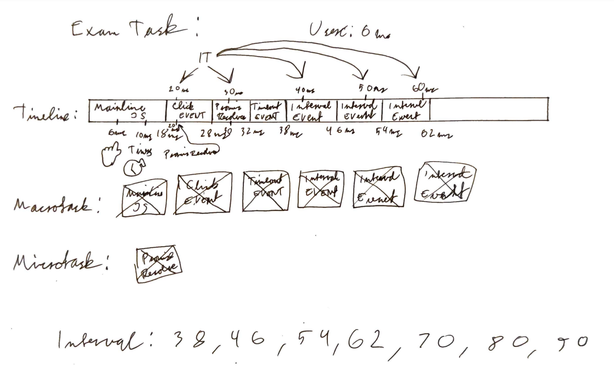
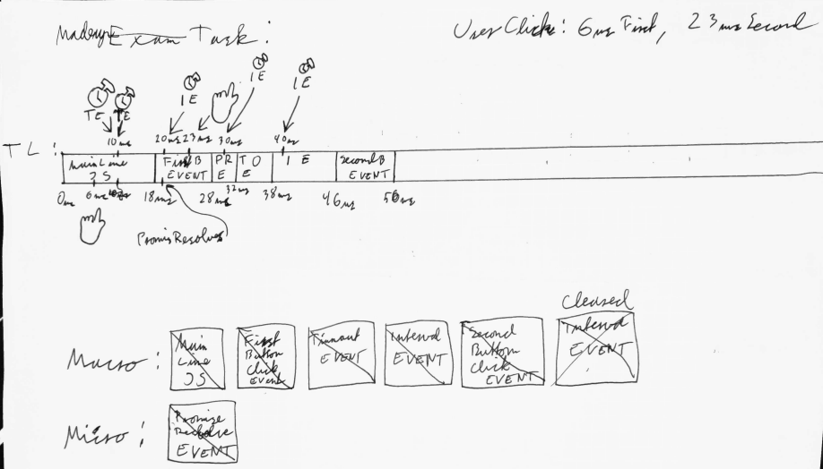

Rules:
Macrotask is everything except promises

Microtasks are promises

Do not care about rendering

You add a event to the macrotasks if the event is not in the macrotask or it is being executed already.

Timeout intervals can be executed closer to eachother than specified.
Timeout will always run after or on the the specified amount.

ClearTimeout clears the timeout.
ClearInterval clears the interval.

### Task from exam:
### Question:

Consider the following HTML/JavaScript. This code runs on a computer of a super-user, who clicks the button myButton 6 milliseconds after the execution starts.

What happens at particular time points?

```js
<button id="myButton"></button>
<script>

	setTimeout(function timeoutHandler() {
	/* code that runs for 6 ms*/
	}, 10};


	setInterval(function intervalHandler() {
	/* code that runs for 8 ms*/
	}, 10};

	const myButton = document.getElementById("myButton");


	myButton.addEventListener("click", function clickHandler(){
		Promise.resolve().then(  ()  =>  {
			/* some promise handling code that runs for 4 ms*/}
		);

		/* click handling that runs for 10 ms*/
	
	});

	/* code that runs for 18 ms*/
</script>
```

### Answer:



This is how the format for answering will be:
![[Pasted image 20231111105749.png]]

### Made up task

### Question:

Consider the following HTML/JavaScript. This code runs on a computer of a super-user, who clicks the button first button 6 milliseconds after the execution starts and the second 23 ms.

What happens at particular time points?

```javascript
<button id="first"></button>
<button id="second"></button>
<script>

	setTimeout(function timeoutHandler() {
	/* code that runs for 6 ms*/
	}, 10};


	setInterval(function intervalHandler() {
	/* code that runs for 8 ms*/
	}, 10};

	//setInterval id == 2

	const first = document.getElementById("first");
	const second = document.getElementById("second")


	first.addEventListener("click", function clickHandler(){
		Promise.resolve().then(  ()  =>  {
			/* some promise handling code that runs for 4 ms*/}
		);

		/* click handling that runs for 10 ms*/
	
	});


	second.addEventListener("click", function clickHandler(){
		clearInterval(2)
		/* click handling that runs for 10 ms*/
	
	});

	/* code that runs for 18 ms*/
</script>
```

### Answer:
