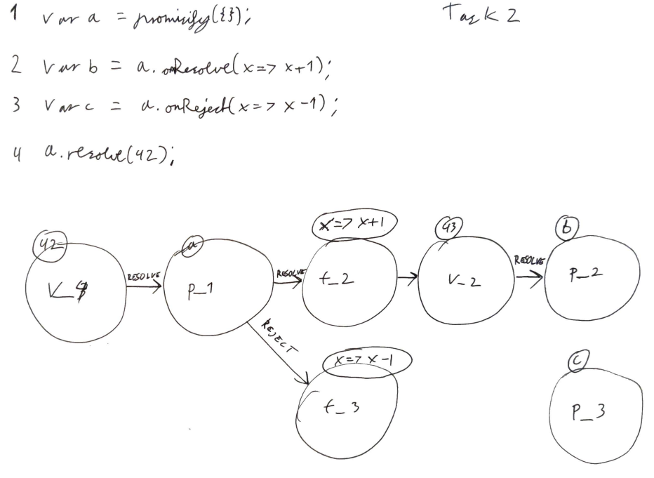
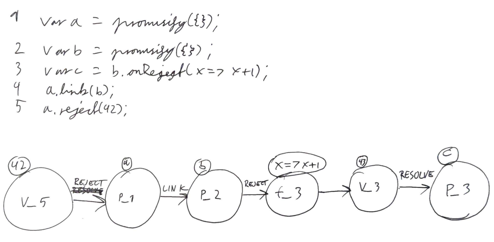

# Notat:
![[Pasted image 20231114120050.png]]

### Task from slides:
### Question 1 :
1 var a = promisify({}); 
2 var b = a.onResolve(x => x + 1); 
3 a.resolve(42);

### Answer:

`42`: (V_3) => Resolve => `a`:(P_1) => Resolve => `x=x+1`: (t_2)

### Question 2 :

1 var a = promisify({}); 
2 var b = a.onResolve(x => x + 1); 
3 var c = a.onReject(x => x - 1); 
4 a.resolve(42);

### Answer:

# Question 3:
1          var a = promisify ( { } ) ;
2          var b = promisify ( { } ) ;
3          var c = b.onReject(x => x +1);
4          a. link (b);
5          a. reject (42);

Consider the JavaScript code on the image above.

Note the syntax here is a blend of JavaScript and λp, which uses:
• promisify to create a promise,
• onReject to register a reject reaction,
• link to link to promises (linking means that when the original promise is resolved/rejected, then the linked promise will be resolved/rejected With the same value)

Draw a promise graph for this code.

Remember to use the names of nodes in that graph that represent the "type" of node:
	v for value
	f for function
	p for promise

with a subscript that represents the line number where that particular value/function/promise has been declared/where it appears first.

For example, the value 42 on line 5 will be denoted by v5 in the promise graph.
### Answer:

