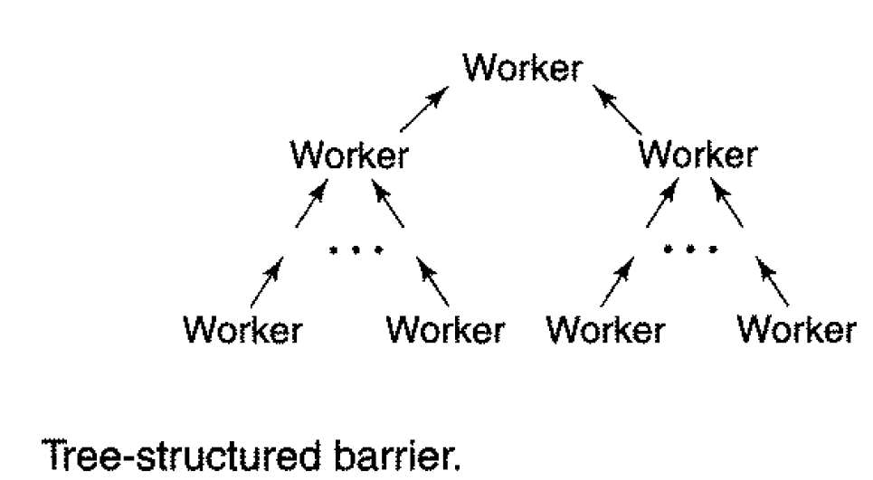

# Multiprogramming

In short, multiprogramming is when multiple programs execute simultaneously (or concurrently). In this repo, we will
touch on how multiple java `Threads` shares resources.

---

## The Dining Philosophers

### The Problem

> In computer science, the dining philosophers problem is an example problem often used in concurrent algorithm design
> to illustrate synchronization issues and techniques for resolving them.
>
> -- [Wikipedia](https://en.wikipedia.org/wiki/Dining_philosophers_problem)

In short, five philosophers are seated around a table with five plates and five utensils available. For simplicity,
we'll use chopsticks. Each philosopher needs two chopsticks to be able to eat, so there's at most two philosophers that
can eat at the same time. After a philosopher has finished eating, she'll put down both chopsticks, making them
available for the other philosophers.

The problem is to design a solution (a concurrent algorithm) so that no philosopher will starve, i.e., each will
alternate between thinking and eating without anyone having to wait to eat forever.

---

## Intrinsic Locks

For a long time, intrinsic locks is all the support that Java provided for concurrent programming. However, now we can
use the library in the package `Java.util.concurrent` which provides enhanced locking mechanisms. Intrinsic locks are
convenient, but limited. Problems with them are

- There's no way to interrupt a thread that's blocked as a result of trying to acquire an intrinsic lock.
- There's no way to time-out while trying to acquire an intrinsic lock.
- There's exactly one way to acquire an intrinsic lock, by using the `synchronized` key-word.

Which means that the lock acquisition- and release method have to take place in the same method and have to be very
strictly nested. Also, that declaring a method as `synchronized` is just a syntactic sugar for surrounding the methods
body with a `synchronized (this){}` block.

So instead of declaring a method as synchronized like this `public synchronized void someMethod() {}`, we could write
it like this

```
public void someMethod(){
    synchronized(this){
    //method body
    }
}
```

So a `synchronized` method is the same as putting the method body into a `synchronized (this){}` block.

---

## Reentrant Locks

Reentrant locks allows us to go beyond the restrictions of Intrinsic locks by providing explicit `lock()` and `unlock()`
methods.

```
public class Main {
    public static void main(String[] args) {

        Lock lock = new ReentrantLock();
        lock.lock();

        try {
            // use shared resources
        }
        finally {
            lock.unlock();
        }
    }
}
```

The try-finally block is a good practice to ensure that the lock is always released no matter what happens in the code
that the lock is protecting.

### Overcoming restrictions of Intrinsic lock

We will now have a look on how the class Reentrant lock helps us overcome the restrictions that intrinsic locks have.

Because the execution of a `Thread` that is blocked on an intrinsic lock cannot be interrupted, we have no way to
recover from a deadlock. We can see an example of this in the class `Uninterruptable` that produces a deadlock situation
and then tries to interrupt the threads. When ran, the class is going to deadlock forever so the only way to exit it
will be to kill the program.

The solution to this problem is to implement the code with reentrant locks instead of with intrinsic locks.
In the class `Interruptible`, both treads are interruptible, and when running the code, both threads indeed gets
interrupted.

Here is the code for the `Main()`-method for the `ReentrantPhilosopher`-class:

```
import java.util.concurrent.locks.ReentrantLock;

public class Main {
    public static void main(String[] args) throws InterruptedException {

        // List of five philosophers
        ReentrantPhilosopher[] philosophers = new ReentrantPhilosopher[5];

        // List of five chopsticks
        ReentrantLock[] chopsticks = new ReentrantLock[5];

        // For each chopstick, we initialize them before starting the corresponding thread
        for (int i = 0; i < 5; i++){
            chopsticks[i] = new ReentrantLock();
        }

        // For each philosopher, we initialize them before starting the corresponding thread
        for (int i = 0; i < 5; i++) {
            philosophers[i] = new ReentrantPhilosopher(chopsticks[i], chopsticks[(i+1) % 5]);
            philosophers[i].start();
        }

        // Use the join()-method to wait until each of the corresponding threads finishes execution
        for (int i = 0; i < 5; i++) {
            philosophers[i].join();
        }
    }
}
```

---

## The Dining Philosophers

### Solution 1

**Reentrant Locks**

Reentrant Locks allows to overcome another limitation of intrinsic locks. The class allows us the limit the waiting
period when we try to acquire a lock. We can see how this provides a possible solution for the dining philosophers
problem in the `Philosopher`-class.

The `tryLock()`-method that is used prevents infinite deadlocks, but that doesn't automatically mean that this is a good
solution. It doesn't avoid deadlocks, it just provides a way to recover when it happens. Secondly, there's still a
possibility that a _livelock_ occurs. A livelock is when all threads timeout, or that all philosophers are stuck waiting
for the right chopstick, resulting in a deadlock. Although the deadlock doesn't last forever, it means that no progress
can be made either, i.e. nothing gets executed in the program.

This situation can be mitigated by giving each thread a different time-out value, this will f.ex. minimize the chances
that they will all timeout simultaneously. All in all, using timeouts provides a solution, but it is far better to avoid
deadlocks all together.

---

## Condition variables

Quite often in concurrent programming, there's a need to wait until a certain event happens. For example, one might need
to wait for a moment when a queue becomes non-empty before removing an element from it , or we need to wait before some
space becomes available in a buffer before we can add something to it. This is where _condition variables_ come into 
play.

Let's see how we can use condition variables effectively in code. We shall follow a simple example in this sudo code
which uses the method `await()`.

```
    // Define an reentrant lock object
    ReentrantLock reentrantLock = new ReentrantLock();

    // Define condition that we initialize with the method, 'new Condition()', of the lock that we have defined
    Condition condition = reentrantLock.newCondition();

    // Lock the reentrant lock
    reentrantLock.lock();

    // try-finally block
    try {
        // While the condition is not true, we wait for the condition to be true
        while(){

            // await() automatically releases the lock and blocks the thread on the condition variable.
            condition.await();
        }
        // Use shared resources after condition has become true

    }
    // Unlock the lock after using the shared resources
    finally { reentrantLock.unlock(); }
```

To indicate that the condition variable is true, another thread would use the method `signal()` or `signalAll()`, to
signal that the condition has become true. The method `await()` will then unblock and re-acquire the lock.

When a thread is doing operations in a try-finally block using `await()`, it looks as if this operation done
_atomically_ for other threads, i.e. it looks like a single operation that is either performed or not. An _atomic_
operation cannot be suspended halfway to give the control to other threads.

When the method `await()` returns, it only means that the condition _might_ be true, this is why `await()` is invoked in
a loop. Indeed, the thread should go back to check whether the condition is true and potentially block on `await()`
again and wait for it to become true once more.

---

## The Dining Philosophers

### Solution 2

Let's now get back to the Dining Philosophers Problem for another potential solution. Instead of having a separate class
for chopsticks, but use the fact that a philosopher can eat only if the neighbour to the left and right are thinking.

The main class for this solution is

```

```

---

## Atomic Variables

This method of the class AtomicInteger is functionally equivalent to the class count++, but it performs atomically. The
use of atomic variables instead of locks gives many advantages:

1.  We cannot anymore forget to acquire the lock before we perform some operation
2.  We avoid deadlocks
    Atomic variables are the basis of the non-blocking, lock-free algorithms, which achieve synchronization without 
    locks and blocking.

### Volatile variables

In Java, you can mark a variable as 'volatile'. Doing so, guarantees that the reads and writes to that variable will not
be rewarded by the compiler or Java Virtual Machine. However, volatile is a very weak form of synchronization. It would
not help fix the `AtomicCounter`-class because making `count` volatile would not ensure that `count++` is atomic.

---

## Recap

So far, we've discussed _sequential_ programs, which has one Thread of execution, and _concurrent_ programs, which has
multiple Threads of execution.

We will study two different approaches to concurrent programs:

- Shared Memory concurrency
  - Threads communicate via variables in shared memory
  - Access to those variables must be synchronized
- Message Passing concurrency
  - Threads communicate by sending/receiving messages
  - All memory is local to threads/processes.
  - Distributed programs:
    - They execute on different machines
    - They communicate over a network

---

### Why Concurrent Programs? Why do we study this topic?

1. Performance - Time gets saved if work can be subdivided into concurrent tasks.
2. To model concurrent phenomena such as:
   - Graphical User Interface (GUI) events
   - Access to the same information/resources by many

---

## Shared Memory Concurrency

Shared memory concurrency is important because:

- It matches common hardware (many CPUs, each have many cores)
- It is supported by mainstream languages (Java, C++, ect... )
- Even on one-core machines, it is a natural model for capturing real life concurrency

Basic properties for shared memory concurrency:

- Each thread executes its own sequence of operations
- The operating system decides
  - which thread gets a turn to execute
  - for how long a thread gets to execute
  - on which core a thread executes
    - The programmer may block threads, but _not_ force them to execute

## Simple Programming Language Await

In what follows in this course we'll use a special version of an imperative programming language called Simple
Programming Language Await. It has a normal C-style syntax and Hoare-style pre-/post-conditions that may surround every
instruction in the language.

---

Example:

```
// First statement takes variable x and increases it by value z
x = x+z;

// Second statement takes a variable y and increases it by value z
y = y+z;
```

Now we want to analyse what the state of the program is before these two statements gets executed

> Pre-condition: x == a && y == b (what is assumed to be true before a program runs)

> Run the two statements

> Post-condition: x = a+z && y = b+z (what will be true after the program runs, if it terminates)

NOTE: pre-/post-conditions are not executed, they're only for the programmer to analyse the code.

---

In addition to pre-/post-conditions that we can add to every statement, we also have the parallel execution operators:
`co` ... `oc`. The dots between the two operators will be a list of processes, separated by the double vertical bars
`co S_1 || S_2 || S_3 || ... || S_N oc` where the programs `S_1, ..., S_N` are executed concurrently, and the whole
statement terminates after all the processes has all finished terminating. So for the example code above would run
concurrently if it was written like this:

```
co
x = x+z; || y = y+z;
oc
```

The pre- and post-conditions would still be valid because processes are independent, i.e. they do not write to the same
variables. Neither writes to a variable that the other reads, so there's no interference. In general, parallelizing
statements invalidates the post-conditions, that is, in the sequential version, the post-conditions hold, but in the
concurrent version, the post-condition it might not hold.

In our conditions, the post-condition holds because of their independence, but in the following example, the post
condition changes:

```
// pre-condition: {x == 0}
co x = x+1; || x = x-1 oc
// post-condition: {x == -1 OR x == 0 OR x == 1}
```

If this code had been run sequentially, the post-condition `{x==0}`, would be true, but since it's ran concurrently
the post-condition changes. This is because with sequential programs the scheduler assumes that the operations of all
individual processes are executed in a sequential order, where each process's operations are in program order.

```
// P1 and P2 consists of the following operations
P1: OP1, OP2, ..., OP4
P2: OP1, OP2, ..., OP5

//Then the program executes them f.ex. like
P1_OP1
P1_OP2
P2_OP1
P1_OP3
P2_OP2
P1_OP4
P2_OP3
P2_OP4
P2_OP5
```

So the two programs are executed in order, even though they're interchanging. So, the result of an execution is the same
as the order they're written, and the execution if sequentially consistent. If the operations were executed like this

```
P1_OP1
P1_OP2
P2_OP1
P1_OP4
P2_OP2
P1_OP3
...
```

Then this would not be true, `P1_OP4` is executed before `P1_OP3`, so they are not executed in program order.

Sequential consistency is _wishful thinking_ because compilers and hardware re-order operations, so in reality we cannot
ensure that the operations are executed in the order they're written. In reality, the operations are executed with
relaxed memory models, so the sequential consistency is preserved for data-race free programs. Data-race means that two
processes concurrently access the same memory locations and at least one access of this is a `write` and the accesses
are not synchronized.

---

## Atomic Operations

An atomic operation is an operation that cannot be subdivided, that is, in the middle of an atomic operation we have no
observable, or intermediate, state. They are language-dependant. Only reading or only writing a variable is usually
atomic, but reading AND writing to a variable is not.

So `x=y` is not atomic because we first read the variable `y` before writing it to the variable `x`, and `++x` is
not atomic either because we first have to `read` the variable `x` before we `write` to it (by adding 1 to it).

There are special atomic operations/atomic variable types in programming languages, f.ex. in Java it was `AtomicInteger`
and in C++ we might use `atomic<int> x;` and then `x += 1` would be atomic.

Some language constructs may allow creating large atomic blocks. A statement with at most one atomic operation plus
operations on local variables can be considered atomic. This is referred to as the _**AT MOST ONCE**_ rule.

> At most once
>
> When a code statement has at most one atomic operation and the rest of the operations are performed on the local
> variables, then the whole statement can be considered atomic.

## Mutual exclusion

Atomic operations on a variable cannot happen simultaneously. In a way, one "happens" before the other, in that case we
have mutual exclusion.

---

Let's go back to the example:

```
co x = x+1; || x = x-1 oc
```

What are the atomic operations here?

We first `read` the value `x`, then we increase it before we `write` the increased value to `x`

```
Process 1:
READ x    == x.getValue();  (R1)
INCREASE
WRITE x   == x.setValue();  (W1)

==> x.setValue( x.getValue() + 1);

Process 2:
READ x    == x.getValue();  (R2)
DECREASE
WRITE x   == x.setValue();  (W2)

All in all we have 4 atomic operations: R1, W1, R2, W2
```

The program order is as follows: R1 happens before W1 and R2 happens before W2.
When we have interleaving, we get six possible options for the result:

```
0     -1    1     -1    1     0
R1    R1    R1    R2    R2    R2
W1    R2    R2    R1    R1    W2
R2    W1    W2    W1    W2    R1
W2    W2    W1    W2    W1    W1
```

Only two of the interleavings are optional/viable, and those are the ones which gives the result 0. But the four others
yields a result which gives the wrong answer.

---

We can view the execution of a concurrent program as an interleaving of the atomic actions executed by individual
processes / threads. When processes interact, not all interleavings are likely to be acceptable. The role of
synchronization is to prevent undesirable interleavings and this is done by combining _fine-grained_ atomic actions into
_coarse-grained_ atomic actions.

> Fine-grained atomic actions are implemented directly by the hardware on which a concurrent program executes.

> Coarse-grained atomic actions are compositions of several fine-grained atomic actions.

Using synchronization as a way to prevent undesired interleavings, is also possible by delaying the execution of a
process until the program state satisfies some predicate (some _boolean_ condition).

> Mutual exclusion is when we combine fined-grained atomic actions into composite coarse-grained atomic actions.

> Conditioned synchronization is when we delay the execution of a process until the program state satisfies some
> predicate.

_**An atomic action makes an indivisible state transformation.**_ This means that any intermediate state that might
exist in the implementation of the action, must not be visible to other processes. In a sequential program, assignment
statements appear to be atomic because no intermediate state is visible to the program. However, this is not generally
the case in concurrent programs because an assignment statement might be implemented by a sequence of fine-grained
machine instructions.

---

### Summary of Assumptions

In what follows, we'll assume that the machines on which we execute our concurrent programs have the following realistic
characteristics:

1. Read and write values that fit into a word are atomic. The values of the basic types, such as integers, are stored in
   memory elements. They're read and written as atomic actions.
2. Values are manipulated in registers. Values are manipulated by loading them into registers, operating on them there,
   and then storing the results back into memory.
3. Registers are local to processes. Each process has its own set of registers. If the same processes changes from one
   process to another, we have so-called _context switch_. This is realized either by having distinct sets of registers, 
   or by saving and restoring register values whenever a different process is executed.

Then, any intermediate results that occur when a complex expression is evaluated are stored in registers or in memory
which private to the execution process, i.e. intermediate results, "temporaries", are local.

With this machine model, if an expression in one process does not reference a variable which is modified by another
process, then the expression evaluation will appear to be atomic (by the _at-most-once_ property) even if it requires
executing several fine-grained atomic actions.

There are two reasons for this:

1. None of the values on which our expression depends, could possibly change while this expression is being evaluated.
2. No other process can see any temporary values that might be created while the expression is being evaluated.

Similarly, if an assignment statement in one process, does not reference any variable that is modified by another
process, then the execution of the assignment will appear to be atomic. This happens, f.ex. when the value that we try
to assign to a variable only references local variables.

Unfortunately, most statements in concurrent programs that references shared variables do not meet the both of the
requirements above. However, a weaker requirement (_at-most-once_ property) is often met.

---

## At-Most-Once Property

Consider the assignment statement `x = e`, where we assign the value `e` to the variable `x`.

Let us introduce the notion of a _critical reference_. A _critical reference_ is a reference to a variable written to by
another process.

If an expression `e` has no critical references, then `e` appears to be atomic. So, `x = e` satisfies the at-most-once
property, if `e` contains at-most-one critical reference, and `x` is not read by another process. `x = e` will also
satisfy the at-most-once property if `e` contains NO critical references.

It is called the at-most-once property because there can be at most one shared variable, and it can be referenced at
most one time.

Examples:

```
int x = 0;
int y = 0;

1. co x = x+1 || y = y+1 oc
2. co x = y+1 || y = y+1 oc
3. co x = y+1 || y = x+1 oc
```

1. In the first example, there are no critical references because `x` is only being read and written by the first 
   process, and `y` is only being read and written by the second process. So both processes satisfy the at-most-once 
   property.

2. In the second example, `y` is being read and written to `x` by the first process, while `y`is being read and written
   to`y` by the second process. So `y` is the critical reference because it's being written to by the second process and
   read by the first, but there's only that one critical reference. Thus, both processes satisfies the at-most-once
   property, since they both contain at most one critical reference.

3. In the third example, the first process is reading the variable `y` and writing it to the variable `x`, and the
   second process is reading the variable `x` and writing it to the variable `y`. Neither processes satisfy the at-most-
   once property because we refer to `y` in the first process `x=y+1` and `y` is assigned a value in the second process.
   And we refer to `x` in the second process `y=x+1` and `x` is assigned a value in the first process.

If an expression or assignment does not satisfy the at-most-once property, it often must be arranged to be executed
atomically. So we can use synchronization to create a coarse-grained atomic action.

---

## Simple Programming Language Await (continuing)

Let's now have a look at the constructions that our `await` language has.

```
for [i=0 to n-1] { a[i] = 0; }
co [i=0 to n] { a[i] = 0; }
process foo { ... }
process bar { [i=1 to n] { write(i); }
<await(B) S;>
<S>
<await(B)>
```

In the first line,

`for [i=0 to n-1] { a[i] = 0; }`

we have a `for` statement with one several quantifier `i=0 to n-1`, which introduces a new index
variable, gives its initial value, and specifies the range of value in the index variable. The brackets are used around
the quantifiers to indicate that there is a range of values as in an array declaration.

Apart, from the `co` `oc` statements, there is a second form of the `co`-statement that uses one or more quantifiers as
a shorthand way to express that a set of statements is to be executed in parallel for every combination of values for
the quantifier variables.

The second line,

`co [i=0 to n] { a[i] = 0; }`

creates n+1 processes, one for each value of i. The scope of the quantifier variable is the process declaration and each
process has a unique value of i.

The third line,

`process foo{ ... }`

is the process declaration, which essentially is an abbreviation of the co-statement, with one arm and/or one
quantifier.

The fourth line,

`process bar[i=1 to n]{ write(i); }`

is declaring an array of processes by appending the quantifier `[i=1 to n]` to the name of the process `bar`. The order
in which th process writes values, is non-deterministic.

This means that the path of execution isn't fully determined by the specification of the computation, so the same input
can produce different outputs. This is because `bar` is an array of n distinct processes and processes execute in an
arbitrary order.

---

### Disjoint processes and read/write variables

```
V = a set of global variables in a statement or an expression
W = a set of global write-variables
```

_**For the global variables in V**_

For an assignment _statement_ `V(x=e)`, the set of global variables will be a union `V(e) ∪ V(x)`.

For a _sequence of statements_ `S_1, S_2, ..., S_n`, the set of global variables, will also be a union of the global
variables over the sequences:

`V(S_1, S_2, ..., S_n) = V(S_1) ∪ V(S_2) ∪ ... ∪ V(S_n)`

For the `if ... then ... else` statement, the set of global variables, is again, a union of all the global variables in
the boolean expression, and the set of global variables in the statement S:

`V(if b then S) = V(b) ∪ V(S)`.

_**For the global write-variables in W**_

For an _assignment_ statement `x=e`, the set of write variables will be `{x}`, for the _sequence of statements_
`S_1, S_2, ..., S_n`, the set of global write-variables will be a union of global write-variables of the sequences:
`W(S_1, S_2, ..., S_n) = W(S_1) ∪ W(S_2) ∪ ... W(S_n)`.

**How can one express different properties using `V` and `W`?**

1. No common variables for `S_1, S_2, ..., S_n` : `V(S_1) ∩ W(S_2) = ∅` => No interference

2. Another possible condition is that the set of global variables in `S_1` intercepted with the set of global write
   variables in `S_2`, is the same as the set of global write-variables in `S_1` intersected with the global variables 
   in `S_2` and is also the same as the empty set : `V(S_1) ∩ W(S_2) = V(S_2) ∩ W(S_1) = ∅`. This means that read-only
   variables cause _no interference_. This means that no matter what value the read-only variables has, it will not 
   affect the other global variables.

---

## Coarse-grained atomic actions

When non-interference does not hold, we must restrict interleavings. Interleavings is a way to run multiple programs in
a single thread, or on a single cpu core. We do this either by synchronization, atomic blocks, etc.

`co <x=x+1> || <x=x-1> oc`

Since the assignments are written within angel brackets `<>`, they are atomic actions, i.e. intermediate states are not
visible for other processes, and variable changes from other processes are not observed.

---

## Simple Programming Language Await (continuing)

We will specify synchronization by means of the `await` statement:

`<await (B) S;>`

the await-statement is enclosed within angle brackets to indicate that it is an _atomic_ statement. Here, the
await-statements ensures that the boolean expression `B` is guaranteed to be true when the execution of `S` begins,
and no internal state in `S` is visible for other processes.

So, for example in the statement

`<await (s>0) s = s-1;`

the assignment/update of the variable `s`, will only decrement the value of `s` after the value of `s` is greater than 0.

The `await` statement is a powerful statement because it can be used to specify arbitrary coarse-grained atomic actions,
which also makes it convenient for expression synchronization. The expressive power also makes the `await` statement
very expensive to implement in its most general form. However, there are many special cases of the `await`-statement
that can be implemented efficiently, like for example `<await (s>0) s = s-1;` above, which is an example of a
"_**P operation on semaphore s**_".

> **_Semaphore_**
> A semaphore is a variable or abstract data type used to control access to a common resource by multiple threads and 
> avoid critical section problems in a concurrent system such as a multitasking operating system. Semaphores are a type 
> of synchronization primitive.

The general form of the `await` statement specifies mutual exclusion and conditioned synchronization.

> _Mutual exclusion_ is a type of synchronization that ensures that statements in different processes cannot execute at
> the same time.
>
> _Conditioned synchronization_ is a type of synchronization that involves delaying a process until some Boolean 
> condition is true.

If you want to _**only**_ specify _**mutual exclusion**_ you can abbreviate the await statement as follows: `<S;>`.

For example, the statement `<x=x+1; y=y+1>` is atomically incrementing `x` and `y`. The internal state in which `x` has
been incremented and `y` is yet to be incremented, is by definition not visible by other processes that reference `x`or
`y`! This is the whole point of executing the statements atomically, which we do by enclosing them in angle brackets.

In the general form `<await (B) S;>`, `S` is a single assignment statement and if it has the `at-most-once`-property, or
`S` is implemented by a single machine instruction, then `S` will be executed atomically. This means that `<S;>` and
`S;`are the same, i.e. they have the same effect. So we don't have to use the angle brackets.

If you want to _**only**_ specify _**conditioned synchronization**_, you can abbreviate the await statement as
`<await (B);>`.

For example, if you want to delay the execution of a process until some variable count is greater than zero, you write
`<await (count>0);>`. Also, if `B` meets the requirements for the `at-most-once`-property, then `<await (B);>` can be
implemented as `while (not B);`. The previous while-loop is an example of a `spin-loop` i.e. the while loop has an empty
body, so it just spins until `B` becomes true.

We can consider two types of the atomic actions: The conditional and the unconditional atomic actions.

1. The conditional atomic action is an await statement with a guard (B), such an action cannot execute until B is true,
   and if B is false, it can only become true as a result of an actions taken by other processes. Thus, a process that 
   is waiting to execute a conditional atomic action could wait for an arbitrarily long time.
2. The unconditional atomic action is the one that does not contain a delay-condition (B), such an action can execute
   immediately, with the requirement that it executes atomically.

---

## Properties of concurrent programs

**Definitions:**

- State - a snapshot of values of all the shared variables
- History - a sequence of states or a sequence of memory operations
- Property - a predicate over program history
- True property - a predicate that is true for all possible histories

**Some properties of interest:**

- Safety - programs cannot reach a bad state
- Liveness - programs will eventually reach a desired state
- Partial correctness - if a program terminates, it does so in a desirable final state
- Termination - all histories are finite
- Total correctness - partial correctness and termination

### How to ensure the desired properties?

- Testing
  - Increases confidence, but is not a proof
  - Impractical to cover all states
- Operational reasoning
  - Analyse all possible histories of programs
- Formal analysis
  - Produce a proof
  - Hoare-triples (pre-condition, statement, post-condition)

**Hoare triples**

```
int x = get_number();
if (x==0) throw "value is too small!";
y = isprime(x);
```

One could write pre- and post-conditions for each of the three statements in this program:

```
{no pre-condition}
int x = get_number();
{x>=0}

{x>=0}
if (x==0) throw "value is too small!";
{x>=1} (after this statement, we either get an exception thrown, or x is gte 0)

{x>=1}
y = isprime(x);
{y==0 || y==1} (isprime() is a boolean function)
```

## Safety and Liveness Properties (of concurrent programs)

Every interesting property can be formulated as safety or liveness. The key-safety property is that the final state is
correct, and the key-liveness property is that the program will terminate. These properties are equally important for
concurrent programs.

Important safety-properties:

- Mutual exclusion
- Absence of deadlock

It's bad for mutual exclusion to have more than one process to execute critical sections of statements at the
same time. It's bad for deadlock to have all processes wait for conditions that might never occur, recall the case with
the dining philosophers.

Important liveness-properties:

- The process will eventually get to enter a critical section, i.e. a place where we access shared variables.
- A request for service will eventually be honored,
- A message will eventually reach its destination.

Liveness properties are affected by scheduling policies which determine which eligible atomic actions are next to
execute.

## Scheduling Policies and Fairness

- Fairness is concerned with the guarantee that processes get the chance to proceed

Regardless of what the other processes do, each process executes a sequence of atomic actions. An atomic action is
eligible if it is the next atomic action in the process that could be executed. When there are several processes,
there are several eligible atomic actions. A scheduling policy determines which one will be executed next.

Three degrees of fairness that a scheduling policy might provide is unconditional, weak, and strong fairness.

Recall that an unconditional atomic action is one that doesn't have a delay condition and consider the following
program:

```
bool continue = true;
co while(continue); || continue=false; oc
```

The two statements between `co` and `oc` execute concurrently. Suppose now a scheduling policy assigns a processor to a
process until that process either terminates or delays. If there's only one processor, this program will not terminate
when the first process executes first, but when the second process eventually gets a chance to execute. We capture this
in the definition of unconditional fairness.

- **Unconditional fairness**: a scheduling policy is unconditionally fair if every unconditional atomic action (the one 
  that does not have the boolean condition) that is eligible will be executed.

Round-Robin, where time slices are assigned to each process in equal portions in a circular order, would be an
unconditionally fair scheduling policy when we have a single processor. And if we have multiple processors, the parallel
execution would be the unconditionally fair policy.

Now, suppose that the program contains conditional atomic actions, that is await-statements with boolean conditions
`<await (B) S;>`, then we need to make stronger assumptions to guarantee that processes will make progress. This is
because a conditional atomic actions cannot be executed until the condition `(B)` becomes true.

- **Weak fairness**: A scheduling policy is weakly fair if it's unconditionally fair and if every conditional, eligible
  atomic action will be executed eventually, assuming that its condition becomes true and then remains true until it is
  seen by the process that executes the conditional atomic action.

In other words, if `<await (B) S;>` is eligible and `(B)` becomes true, then `(B)` remains true at least until after the
conditional atomic action is executed.

Round-Robin and Time-Slicing is _weakly_ fair scheduling policies if every process gets a chance to execute. This is
because any delayed process will eventually see that the "is-delayed"-condition becomes true.

However, weak fairness is not sufficient to ensure that any eligible await statement eventually executes. This is
because the condition might change from 'false' to 'true' and back to 'false' when a process is delayed.

- **Strong fairness**: A scheduling policy is strongly fair if it's unconditionally fair and every conditional, eligible
  atomic action will eventually be executed assuming that its condition is 'always' (infinitely often) "true".

## Critical Section Problem

Concurrent programs employ two basic kinds of synchronization; Mutual exclusion (ensuring that statements in different
processes cannot execute at the same time) and conditioned synchronization (involves delaying a process until some 
Boolean condition is true).

We will illustrate how to program solutions for two important problems; critical sections (concerned with implementing
atomic actions in software) and barriers (synchronization points that all processes must reach before any process is
allowed to proceed). Mutual exclusion is typically implemented by means of locks that protects critical sections of 
code.

The critical section problem, which we will solve by using coarse grained solution, will use the `await`statement to
implement a lock. Then we'll also consider fine-grained solutions that will use `spin`-locks. 

Finally, we'll have a look at `fair` solutions: the _tie-breaker_ algorithm, the _ticket_ algorithm, and the _bakery_ 
algorithm. We will illustrate different ways to approach the problem that has different performance and different 
fairness attributes. The solutions to the critical section problem are also important because they can be used to 
implement `await`-statements, and hence arbitrary atomic actions.

The critical section problem is one of the classic concurrent programming problems. It was the first problem to be 
studied extensively, and remains of interest since most concurrent programs have critical sections of code. Now we will 
define the problem and develop a coarse grained solution. 

In the critical section problem we have `n` processes, and they repeatedly executes a critical and then a non-critical 
section of code. The critical is proceeded by an entry protocol and followed by an exit protocol, thus we can write it 
as follows:  
```
Process P[i=1 to n]{
  while(true){
    entry protocol;
    _**critical section;**_
    exit protocol;
    non-critical section;
  }
}
``` 
Each critical section is a sequence of statements that access some shared object. Each non-critical section is another 
sequence of statements that doesn't access the shared objects. We assume that a process that enters its critical section 
will eventually exit, that means that _a process may terminate only outside its critical section_. 

Now we want to design the entry and exit protocols (what we have to do before entering and after exiting the critical 
section). We want these protocols to satisfy the following properties:
1. **Mutual exclusion** (at most one process at a time is executing its critical section)
2. **Absence of a deadlock** (or livelock) (If two or more processes are trying to enter their critical sections, then 
   at least one will succeed)
3. **Absence of unnecessary** delay (If a process is trying to enter its critical section, and the other processes are 
   executing their non-critical sections or have already terminated, then the first process is not prevented from 
   entering its non-critical section)
4. **Eventual entry** (A process that is attempting to enter its critical section, will eventually succeed)

The first three properties are safety-properties, and the fourth one is a liveness-property. 
> BAD STATES
> 
> _Mutual exclusion_: when two processes are in the critical section (both are accessing shared resources).
> 
> _Absence of a deadlock_: when all the processes are waiting to enter, but none of them is
> able to do so.
> 
> _Absence of livelock_: is a solution where the processes are alive but looking forever.
> 
> _Absence of necessary delay_: when one process that wants to enter cannot do so even though no other process are in 
> their critical section.
> 
> _Eventual entry_ is a liveness-property because it depends on the scheduling policy. 

A trivial way to solve the critical section problem is to enclose the critical section in angle brackets, i.e. to use
the unconditional `await()`-statement: `<_**critical section;**_>` So mutual exclusion will follow by definition of the 
angle brackets. The other three properties would also be satisfied if scheduling is _unconditionally fair_. 

However, this solution is asking us "How do we implement the angle brackets?". Out of all the four properties listed 
above, the mutual exclusion is the most important. Thus, in all our solutions to the critical section problem, we will 
first focus on satisfying the mutual-exclusion property, and only then will we focus on how to satisfy the other three 
properties. 

To specify the mutual exclusion property, we need a way to indicate if the process is in its critical section. So let us
simplify the notation. We will develop a solution for only two processes, P1 and P2, but the solution can be generalised
for N processes. 

``` 
// Coarse-Grained solution
bool in1 = false; 
bool in2 = false; 

# Solution 1
process P1 {
    while(true){
        <await (!in2) in1=true> // conditional atomic action
        critical section;
        in1 = false;
        non-critical section;
    }
}


# Solution 2
process P2 {
    while(true){
        <await (!in1) in2=true> // conditional atomic action
        critical section;
        in2 = false;
        non-critical section;
    }
}
```

### Mutual exclusion (Spin-Locks Test, Set Test, and Test&Set)
The two solutions in the previous section are coarse-grained and the employ two variables, `in1` and `in2`. If we want 
to generalize the solutions for `n` processes, we would have to use `n` variables. However, we can notice that there are
only two interesting states; either one process is in its critical section, or no process is in its critical section. So
one variable should be sufficient to distinguish between these two states, regardless of how many processes we have.

Let's change the code by introducing a single variable `lock` which will indicate when a process is in a critical 
section. That means that `lock` is true when either `in1` or `in2` is true, and otherwise false. In other words, lock is
the same as a disjunction of `in1` and `in2`.

In place of `in1` and `in2` in the original solutions, we are going to use `lock` in the entry and exit protocols. 

``` 
bool lock = false; 

process P1 {
    while(true){
        <await (!lock) lock=true>
        critical section;
        lock = false;
        non-critical section;
    }
}

process P2 {
    while(true){
        <await (!lock) lock=true>
        critical section;
        lock = false;
        non-critical section;
    }
}
```
The significance of the change of variables above, is that almost all machines have some special instruction that can be
used to implement the conditional atomic actions (the await-statements). 

### Critical Sections: Spin Locks
Test and set instructions takes a shared lock variable as an argument and returns a boolean. As an atomic action. The 
test and set, reads and saves the value of `lock`, and sets `lock` to true, and then returns the saved initial value of 
`lock`. 

``` 
bool TestAndSet(bool lock) {
    // Atomically (inside angle brackets)
    < 
        bool initial = lock; // save initial valie
        lock = true;         // set lock to true
        return initial;      // return initial value
    >
}
```
We can now re-implement the solution we saw above by using the `TestAndSet()`-method.
```
// Solution using Test & Set protocol
bool lock = false; 

process P1 {
    while(true){
        while(TestAndSet(lock)) { }
        critical section;
        lock = false;
        non-critical section;
    }
}

process P2 {
    while(true){
        while(TestAndSet(lock)) { }
        critical section;
        lock = false;
        non-critical section;
    }
}
```

In particular, the conditional atomic actions will be replaced by loops that do not terminate until `lock` is false. The
`while()` loop does not terminate until `lock` is false, and hence, since all processes execute the same protocol, this 
solution will work for any number of processes. When a `lock`-variable is used as shown above, it is typically called a 
`spin lock`. This is because the processes keep looping (spinning) while waiting for the lock to be cleared. 

The solution above has the following properties: 
1. Mutual exclusion is ensured because if two or more processes are trying to enter their critical section, only one can 
   succeed in being the first to change the value of `lock` from false to true. Hence, only one will terminate its entry 
   protocol.
2. Absence of deadlock results from the fact that if both processes are in their entry-protocols, the `lock` is false, 
   and hence, one of the processes will succeed in entering its critical section. 
3. Absence of necessary delay results from the fact that if both processes are outside their critical section then 
   `lock` is false, and hence, one can successfully enter if the other is executing its non-critical section or has 
   already terminated.
4. Eventual entry is not necessarily guaranteed. If the scheduling is strongly fair, then a process trying to enter its
   critical section will succeed because `lock` will become false infinitely often. And if a scheduling policy is only 
   weakly fair, which is most commonly the case, then a process could spin forever in its entry-protocol. However, this 
   can only happen if there are always other processes trying and succeeding to enter their critical sections. This
   should not be the case in practice. 
   
So far, the solution is likely to be fair and should be correct, but experiments on multiprocessors have shown that it 
can lead to poor performance if several processes are competing for access to a critical section. This is because `lock`
is a shared variable, and every delayed process can continuously reference it. This "hot-spot" causes `memory-
contention`, which degrades the performance of memory units. The `TestAndSet()` instruction writes into `lock` every
time it is executed, even when the value of `lock` does not change. Since shared-memory multiprocessors employ caches 
to reduce traffic to primary memory, this makes `TestAndSet()` significantly more expensive than an instruction that 
would just read a shared variable. 

So let's see how we can reduce the overhead of memory contention by modifying the entry-protocol. Instead of simply 
spinning until a `TestAndSet()`-returns true, we can increase the likelihood that it returns true by using the following
entry-protocol

```
bool lock = false; 
// Solution using Test & Test & Set protcol
process P {
    while(true){
    
        // Spin while lock set
        while(lock) { }
        
        // Try to grab the lock
        while(TestAndSet(lock)) { 
        
            // Spin again if fail
            while(lock){ }
        }
        critical section;
        lock = false;
        non-critical section;
    }
}
```
This is called the Test-and-Test-and-Set protocol because a process tests `lock` until there's a possibility that Test-
and-Set can succeed. In the two additional loops (the two spinning while loops), `lock` is only examined, so its value
can be read from a local cache without affecting other processors, thus, we reduce memory contention, but it does not
disappear completely. In particular, when `lock` is clear, then at least one, if not all, delayed processes will execute
`TestAndSet()` even though only one can proceed. 

### Implementing await statements
Any solution to the critical section problem can be used to implement an unconditional atomic action `<S;>` by hiding
internal control points from other processes. We denote

`CSenter` - critical section entry protocol
`CSexit` - a critical section exit protocol

Now we can implement `<S;>` as
``` 
CSenter;
S; 
CSexit;
```
This assumes that all code sections in all processes that reference or modify variables (modified by `S`) are protected
by similar entry and exit protocols (The opening angle bracket is replaced by `CSenter` and the closing angle bracket
is replaced by `CSexit`).

So the code block above can be used as a building block to implement the await statement. A conditional atomic action,
`<await (B) S;>`, delays the executing process until `B` is true, then it executes `S`. So `B` must be true when the
execution of `S` begins. To ensure that the execution is atomic we can use a critical section protocol to hide
intermediate states in `S`. We can use a loop to repeatedly test `B` until it is true.
``` 
CSenter;
while (!B) { ... } 
S; 
CSexit;
```
Here we assume that the critical sections in all processes that modify variables that are referenced in `B` or `S` are
protected by similar entry- and exit-protocols.

Now, what do we actually write inside the loop-body? If the body is executed, `B` was false. So the only way `B` can
become true, is if some other process alters a variable which is referenced in `B`. Since we assume that any statement
in other processes that modifies a variable that is referenced in `B` must be in a critical section, we have to exit the
critical section while we wait for `B` to become true. But to ensure atomicity of the evaluation of `B` and the
execution of `S` we must re-enter the critical section before re-evaluating `B`.

So what we might do is to perform the exit-protocol and then the enter protocol:
``` 
CSenter;
while (!B) { CSexit; CSenter; } 
S; 
CSexit;
```
This implementation will preserve the semantics of the conditional atomic actions. Assuming that the critical section
protocols guarantee mutual exclusion, if scheduling is weakly fair, then the process that executes the code-block above
will eventually terminate the loop, i.e. assuming that `B` will eventually become true and remains true, and the
scheduling is strongly fair, the loop will terminate if `B` becomes true infinitely often (This is just the definitions
of the weakly-fair and strongly-fair scheduling policies).

The code-block above is correct, but it is inefficient. This is because a process that executes it, is spinning in a
hard loop; continuously exiting and re-entering its critical section even though it cannot proceed until some other
process modifies a variable referenced in `B`. Once again, this lead to memory contention since every delayed process
continuously accesses the variables that are used in critical section protocols and the variables in `B`.

To reduce memory contention it is preferable for a process to delay for some period of time before re-entering the
critical section. Let us denote, by delay, some code that slows the process down:
``` 
CSenter;
while (!B) { CSexit; Delay; CSenter; } 
S; 
CSexit;
```
### Critical Sections Problem: Fair Solutions 
The `spin-lock` solutions to the critical section problems ensure mutual exclusion, are deadlock/livelock free, and they
avoid unnecessary delay. However, they require a strongly-fair scheduler to ensure eventual entry.

As we have noticed previously, practical scheduling policies are only weakly fair. Although it is unlikely that a
process that is trying to enter its critical section will never succeed, it could happen if two or more processes are
always contending for entry. The `spin-lock` solutions do not control the order in which delayed processes enter their
critical sections when two or more are trying to do so.

We will now talk about fair solutions to the critical sections problem; the _tie-breaker_ algorithm, the _ticket_ 
algorithm, and the _bakery_ algorithm. These solutions only depend on a weakly-fair scheduler, such as Round Robin, 
which merely ensures that each process keeps getting a chance to execute, and the delayed conditions, once true, remains
true. 

The _tie-breaker_ algorithm is very simple for two processes and depends on no special machine instructions, but it is 
complex for `n` processes. 

The _ticket_ algorithm is simple for any number of `n` processes, but it requires a special machine-instruction called 
`Fetch-and-Add`. 

The _bakery_ algorithm is a variation of the _ticket_ algorithm, and it requires no special machine-instruction, but it 
is consequently more complex, although simpler than the `n`-process _tie-breaker_ algorithm. 

#### Tie-Breaker Algorithm
Let's consider the solution for the critical section problem that we have studied before: 
``` 
// Coarse-Grained solution
bool in1 = false; 
bool in2 = false; 

# Solution 1
process P1 {
    while(true){
        <await (!in2) in1=true> // conditional atomic action
        critical section;
        in1 = false;
        non-critical section;
    }
}

# Solution 2
process P2 {
    while(true){
        <await (!in1) in2=true> // conditional atomic action
        critical section;
        in2 = false;
        non-critical section;
    }
}
```
The problem with this solution is that if each process is trying to enter its critical section, there's no control over 
which will succeed. In particular, one process could succeed, execute its critical section, race back around to the 
entry-protocol, and then succeed again. To make the solution fair, the processes should take turns when both are trying 
to enter, so the _tie-breaker_ algorithm (Peterson's algorithm) is a variation of the critical-section protocol that we
considered before. 

Here we would break the tie when both processes are trying to enter, and we will do so by using an additional variable
to indicate which process was last to enter its critical section. Let us consider in detail the coarse-grained solution
with the goal to implement the conditional atomic actions in the entry-protocols using only simple variables and 
sequential statements. 

As a starting point, we consider implementing each await statement by first looping until the guard is false (`!in2`),
and then executing the assignment (`in1=true`). So we can change the entry-protocol for process `P1` as follows:
```  
bool in1 = false; 
bool in2 = false; 
process P1 {
    while(true){
        while(in2) { skip; }    // While in2, do no operation (delay loop)
        in1 = true:             // Then assing in1 to be true (interferes the delay loop in P2)
        critical section;
        
        // The corresponding exit-protocol would set in1 to false
        in1 = false;
        non-critical section;
    }
}

// And similarly in the second process
process P2 {
    while(true){
        while(in1) { skip; }    // While in1, do no operation (delay loop)
        in2 = true:             // Then assing in2 to be true (interferes the delay loop in P1)
        critical section;
        // The corresponding exit-protocol would set in2 to false
        in2 = false;
        non-critical section;
    }
}
```
The problem with this "solution" is that the two actions in the entry-protocol are not executed atomically, i.e. mutual
exclusion is not guaranteed. For example, the desired post-condition for the delay loop in the first process is that 
`in2` is false. 

Unfortunately, this would be interfered by the assignment `in2 = true;` in the second process. Because it's possible, 
for both processes, to evaluate the delay conditions at about the same time, and to find that they're true. Since each 
process wants to be sure that the other is not in its critical section when the while-loop terminates, we could switch 
the order of the statements in the entry protocols, so we would get 
```  
bool in1 = false; 
bool in2 = false; 
process P1 {
    while(true){
        in1 = true:             // Assing in1 to true
        while(in2) { skip; }    // While in2, do no operation (delay loop)
        critical section;
        
        // The corresponding exit-protocol would set in1 to false
        in1 = false;
        non-critical section;
    }
}
```
This helps, but it doesn't solve the problem. Mutual exclusion is ensured, but the deadlock can still happen (if `in1` 
and `in2` are both true), however there's a simple way to avoid a deadlock by using an additional variable to break the 
tie if both processes are delayed. 

So, we'll have a new variable `last` which will be an integer that indicates which of the processes was last to start 
executing its entry-protocol, and then if both processes are trying to enter their critical sections, then the last 
process to start its entry-protocol delays. Then we'll have the following solution
```  
// Coarse-grained solution
bool in1 = false; 
bool in2 = false; 
int last = 1;

process P1 {
    while(true){
        // Entry-protocol 
        last = 1;                   // Assing last to 1
        in1 = true:                 // Assing in1 to true
        <await(!in2 || last == 2;)> // Delay condition
        
        critical section;
        
        // The corresponding exit-protocol would set in1 to false
        in1 = false;
        non-critical section;
    }
}

process P2 {
    while(true){
        // Entry-protocol 
        last = 2;                   // Assign last to 2
        in2 = true:                 // Assing in2 to true
        <await(!in2 || last == 2;)> // Delay condition
        
        critical section;
        
        // The corresponding exit-protocol would set in2 to false
        in2 = false;
        non-critical section;
    }
}
```
This algorithm is very close to a fine-grained solution, that does not require `await`-statements. In particular, if 
each `await`-statement satisfy the requirements for the at-most-once property, then we would implement them with `busy-
waiting`-loops. 

The problem here, is that the `await`-statements reference two variables altered by the other process,
so the at-most-once property does not hold. However, we might observe that in this case it is not necessary that the 
delay conditions (`await<>`) are evaluated atomically. 

Let's see why. Suppose `P1` evaluates its delay-condition and finds that it's true. If `P1` found that 
`int2 == false;`, then `in2` might now be true, however in that case, the process `P1` has just set `last = 2;` and 
hence, the delay condition is still true, even though `in2` changed its value, i.e. if `P1` found that `last = 2;` then 
the condition will remain true, because `last` will not change its value until after `P1` executes its critical section. 

Thus, in either case, if `P1` thinks that the delay-condition is true, then it is in fact true (and then we have the 
symmetric reasoning for `P2`). 

So now that we have established that the delay-conditions doesn't need to be evaluated atomically, we can replace each
`await`-statement by a while-loop that iterates as long as the negation of the delay-condition is false. So we get the 
fine-grained version of the tie-breaker algorithm:
```  
// Fine-grained solution
bool in1 = false; 
bool in2 = false; 
int last = 1;

process P1 {
    while(true){
        // Entry-protocol 
        last = 1;                   // Assing last to 1
        in1 = true:                 // Assing in1 to true
        while(in2 and last==1) skip;
        
        critical section;
        
        // The corresponding exit-protocol would set in1 to false
        in1 = false;
        non-critical section;
    }
}

process P2 {
    while(true){
        // Entry-protocol 
        last = 2;                   // Assign last to 2
        in2 = true:                 // Assing in2 to true
        while(in1 and last==2) skip;
        
        critical section;
        
        // The corresponding exit-protocol would set in2 to false
        in2 = false;
        non-critical section;
    }
}
```
This solution solves the critical section problem for two processes, but we can use the same basic idea to solve the 
problem for any number of processes. In particular, if there are `n` processes, the entry-protocol in each process will 
consist of a loop that iterates through `N-1` stages, and in each stage, we will use the instances of the two-process 
tie-breaker algorithm to determine which processes gets to advance to the next stage. If we make sure that at most one 
process at a time is allowed to get through all the `N-1` stages, then at most one at a time can be in its critical 
section. 

```  
// Fine-grained solution

// in and last are integer arrays with n values 
ArrayList<Integer> in[1:n];   // the value in[i] indicates which stage the process Pi has executed
ArrayList<Integer> last[1:n]; // the value last[j] indicates which process was last in stage j

process P[i = 1 to n] {
    while(true){
        // Entry-protocol 
        for [j = 1 to n] {
            // Remember process i is in stage j and is last
            last[j] = i;
            in[i] = j;
            
            for [k = 1 to n st i != k] {
                // Wait for process k is in higher numbered stage and process i was the last to enter stage j
                while( in[k] >= in[i] && last[j] == i ) { skip; }
            }
        }
        
        critical section;
        
        // Exit protocol
        in[i] = 0; 
        non-critical section;
    }
}
``` 

### Ticket Algorithm
We will now develop an `n`-process solution to the critical section problem. The `ticket-algorithm` is based on drawing 
numbers and then waiting turns. Many establishments employ this method to ensure that the customers are serviced in the 
order of arrival. Upon entering the establishment the customer gets a number that is one larger than the one held by any
other customer. The customer then waits until all customers holding smaller numbers have been serviced. 

This algorithm is implemented by a number dispenser and by a display indicating which customer is being served. If the 
store has one employee behind the service counter, customers are served one at a time in their order of arrival. We can
use this idea to implement a fair critical section protocol. 

Let `number` and `next` be integers that are initially 1, and let `turn[1:n]` be an array of integers, each of which is 
initially 0. To enter its critical section, process `P[i]` first sets `turn[i]` to the current value of `number` and 
then increments `number`. These are a single atomic action to ensure that customers draw unique numbers. Process `P[i]`
then waits until the value of `next` is equal to the number it drew. Upon completing its critical section, `P[i]` 
increments `next`, again as an atomic action. 

```  
int number = 1; 
int next = 1; 
turn[1:n] = ([n] 0);  // array with n elements that are initialized as 0

// n processes
process P[i=1 to n] {
    while (true) {
        
        // Entry protocol
        <turn[i] = number; number += 1; > // single atomic action to ensure the cutomers draw unique numbers
        <await (turn[i] == next);>
        
        critical section; 
        
        // Exit protocol
        <next += 1;>
        non-critical section;   
    }
}
```

>The global invariant is that 0 < next <= number.
>
>The local invariants are: 
>- turn[i] < number
>- if P[i] is in its critical section, then turn[i] == next
>- for all i != j { turn[i] > 0 implies that turn[i] != turn[j] } 

The last invariant says that nonzero values of `turn` are unique. Hence, at most one `turn[i]` is equal to `next`.
Hence, at most one process can be in its critical section. Because nonzero values are unique, we also get the absence 
of deadlock and unnecessary delay. Finally, if scheduling is weakly fair, the algorithm ensures eventual entry, because 
once a delay condition becomes true, it remains true. 

Unlike the `tie-breaker`-algorithm, the ticket algorithm has a potential short-coming that is common in algorithms that
employ incrementing counters: the values of `number` and `next` are unbounded. If the ticket algorithm runs for a very 
long time, incrementing a counter will eventually cause arithmetic overflow. This is extremely likely to be a problem 
in practice. 

The algorithm above contains three coarse-grained atomic actions. It is easy to implement the `await`-statement using a 
busy-waiting loop since the Boolean expression references only one shared variable. The last atomic action 
(`<next += 1>`) can be implemented using regular LOAD and STORE instructions
```  
LOAD  R1, [R0]  ; Load current value of next into R1
ADD   R1, #1    ; Increment R1 by 1
STORE R1, [R0]  ; Store incremented value back to next
```
Because at-most one process can execute the exit-protocol at a time. 

Unfortunately, it is hard to implement the first atomic action (`<turn[i] = number; number += 1; >`) which reads 
`number` and then increments it. 

#### Fetch-and-Add (FA)
Some machines have instructions that return the old value of a variable and increment or decrement it as a single 
indivisible operation `FA(var, incr): (int tmp = var; var = var + incr; return(tmp);)`. This `fetch-and-add` instruction
does exactly what is required for the ticket algorithm. Now, the `ticket`-algorithm using the `fetch-and-add` 
instruction becomes

``` 
int number = 1; 
int next = 1; 
turn[1:n] = ([n] 0);  // array with n elements that are initialized as 0

process P[i=1 to n] {
    while (true) {
        
        // Fetch-and-Add entry protocol
        turn[i] = FA(number, 1) 
        while (turn[i] =! next) { skip; }
        
        critical section; 
        
        // Exit protocol
        next += 1;
        non-critical section;   
    }
}
```
On the machines that do not have `fetch-and-add` or a comparable instruction, we have to use another approach. *The key-
requirement in the ticket algorithm is that every process draw a unique number.* If a machine has an atomic increment
instruction, we might consider implementing the first step in the entry protocol by 

`turn[i] = number; <number += 1;>`. 

This ensures that `number` is incremented correctly, but it does not ensure that processes draw unique numbers. In 
particular, every process could execute the first assignment at about the same time and draw the same number! Thus, it
is essential that both assignments be executed as a single atomic action. 

We've already seen two other ways to solve the critical section problem: `spin-locks` and the `tie-breaker` algorithm. 
Either of these could be used within the `ticket`-algorithm to make number drawing atomic. In particular, suppose 
`CSenter` is a critical section entry-protocol and `CSexit` is the corresponding exit protocol. Then we could replace
the `fetch-and-add` statement in the code above like this: 
``` 
int number = 1; 
int next = 1; 
turn[1:n] = ([n] 0);  // array with n elements that are initialized as 0

process P[i=1 to n] {
    while (true) {
        
        CSenter; turn[i] = number; number += 1; CSexit;
        while (turn[i] =! next) { skip; }
        
        critical section; 
        
        // Exit protocol
        next += 1;
        non-critical section;   
    }
}
```
Although this might seem like a curious approach, in practice it would actually work quite well, especially if an 
instruction like `Test-and-Set` is available to implement `CSenter` and `CSexit`. With `Test-and-Set`, processes might 
not draw numbers in exactly the order they attempt to - and theoretically a process could spin forever - but with very 
high probability every process would draw a number, and most would be drawn in order. This is because the critical 
section within `CSenter; turn[i] = number; number += 1; CSexit;` is very short, and hence a process is not likely to 
delay in `CSenter`. The major source of delay in the `ticket`-algorithm is waiting for `turn[i]` to be equal to `next`. 

### Barriers (intro)
Many problems can be solved using iterative algorithms that successively compute better approximations to an answer, 
terminating when either the final answer has been computed or, in the case of many numerical algorithms, when the final 
answer has converged. Such an algorithm typically manipulates an array of values, and each iteration performs the same 
computation on all array elements. Hence, we can often use multiple processes to compute disjoint parts of the solution
in parallel. 

A key attribute of most parallel iterative algorithms is that each iteration typically depends on the result of the 
previous iteration. One way to structure such an algorithm is to implement the body of each iteration using one or more 
`co` statements. Ignoring termination, and assuming that there are `n` parallel tasks on each iteration, this approach 
has the general form

```  
while (true) {
    co [i = 1 to N]
        // code to implement task i;
    oc
}
```

Unfortunately, the above approach is quite inefficient since `co` spawns `n` processes on each iteration. It is much 
more costly to create and destroy processes than to implement process synchronization. Thus, an alternative structure 
will result in a more efficient algorithm. In particular, create the processes once at the beginning of the computation, 
then have them synchronize at the end of each iteration: 
```  
process Worker[i = 1 to N] {
    while(true) {
        // code to implement task i; 
    }
        wait for all N tasks to complete; 
}
```
This is called a _barrier synchronization_, because the delay point at the end of each iteration represents a barrier 
that all processes have to arrive at before any are allowed to pass. Barriers can be needed both at the ends of loops, 
as above, and at intermediate stages. Next, we'll develop several implementations of barrier synchronization. 

The simplest way to specify the requirements for a barrier is to employ a shared integer, `count`, which is initially 
zero. Assume there are `n` worker processes that need to meet at  barrier. When a process arrives at the barrier, it 
increments `count`; when `count` is `n`, all processes can proceed. This specification leads to the following code 
outline:

```   
int count = 0;

process Worker[i = 1 to N] {
    while(true) {
        // code to implement task i; 
        <count += 1;>
        <await (count == N)
    }
}
```
We can implement the `await`-statement by a busy-waiting loop. If we also have an indivisible increment instruction, 
s.a. `Fetch-and-Add`, we can implement the above barrier by 
``` 
int count = 0;

process Worker[i = 1 to N] {
    while(true) {
        // code to implement task i; 
        FA(count, 1);
        while (count != N) { skip; }
    }
}
```
This is not fully adequate, however. The difficulty is that `count` must be 0 at the start of each iteration, which 
means that `count` needs to be reset at 0 each time all processes have passed the barrier. Moreover, `count` has to be 
reset before any process again tries to increment `count`. 

It is possible to solve this reset problem by employing two counters, one that counts up to `n` and another that counts 
down to 0, with the roles of the counter being switched after each stage. However, there are additional, pragmatic 
problems with using shared counters. 

1. They have to be incremented and/or decremented as atomic actions. 
2. When a process is delayed, as in the code above, it is continuously examining `count`.

In the worst case, `N-1` processes might be delayed waiting for the last process to arrive at the barrier. This could 
lead to severe memory contention. One way to avoid it, is to distribute the implementation of `count` by using `n` 
variables that sum to the same value.

### Flags and Coordinators
Let `arrive[1:N]` be an array of integers initialized to zeros. We can then replace the increment of `count` by 
`arrive[i] = 1`. The predicate `count == arrive[1] + ... + ariive[N]` is a global invariant.

``` 
arrive[1:N] = ([n] 0);  // array with N integers initialized as zeroes
int count = 0;          // the increment of count is replaced by arrive[i] = 1

process Worker[i = 1 to N] {
    while(true) {
        // code to implement task i; 
        FA(count, 1);
        <await (count == N);>
    }
}
```
A predicate is a statement or expression that evaluates to either true or false.
An invariant is a property that remains unchanged throughout the execution of a program. In this case,
the predicate is described as a global invariant, meaning:

    It holds true before and after certain operations or sequences of operations.
    It represents a fundamental property of the program's state that doesn't change over time.
    It provides a way to reason about and prove properties of the program.

Memory contention would be avoided as long as elements of `arrive` are stored in different cache lines (to avoid 
contention when they're written by the process). With this change, the remaining problems are implementing the `await`-
statement in the code above and resetting the elements of arrive at the end of each iteration. 

Using the fact that `count == arrive[1] + ... + ariive[N]` the `await`-statement could be implemented as follows:
``` 
arrive[1:N] = ([n] 0);  // array with N integers initialized as zeroes
int count = 0;          // the increment of count is replaced by arrive[i] = 1

process Worker[i = 1 to N] {
    while(true) {
        // code to implement task i; 
        FA(count, 1);
        < await ((arrive[1] + ... + arrive[N]) == N); >
    }
}
```
However, this re-introduces the memory contention, and, moreover, it is inefficient since the usm of the `arrive[i]` is 
continually being computed by every waiting `Worker`. We can solve both the memory contention and reset problems by 
using an additional set of shared values and by employing an additional process, `Coordinator`. 

Instead of having each `Worker` sum and test the values of arrive, let each `Worker` wait for a single value to become 
true. In particular, let `continue[1:N]` be another array of integers, initialized as zeroes. After setting arrive[i] to
1, `Worker[i]` delays by waiting for `continue[i]` to be set to 1: `< await (continue[i] == 1); >`. 

The `Coordinator` process waits for all elements of `arrive` to become 1, then sets all elements of continue to 1. The 
`Coordinator` process looks as follows:
``` 
int count = 0;          // the increment of count is replaced by arrive[i] = 1

process Worker[i = 1 to N] {
    while(true) {
        // code to implement task i; 
        arrive[i] = 1;                  { 3.12 }
        < await (continue[i] == 1); >   { 3.12 }
    }
}
process Coordinator{
    while (true) {
        for [i = 1 to N] { <await (arrive[i] == 1);> { 3.13 }
        for [i = 1 to N] { continue[i] = 1; }        { 3.13 }
    }
}
```
The `await` statements in `Worker` and `Coordinator` can be implemented by `while` loops since each reference a single 
shared variable. The `Coordinator` can use a `for` statement to wait for each element of `arrive` to be set; moreover, 
because all `arrive` flags must be set before any `Worker`is allowed to continue, the `Coordinator` can test the 
`arrive[i]` in ant order. 

Memory contention is not a problem since the processes wait for different variables to be set and these variables could 
be stored in different cache lines. Variables `arrive` and `continue` are examples of _flag variables_ - a variable that 
is raised by one process to signal that a synchronization condition is true. The remaining problem is augmenting 
`{ 3.12 }` and `{ 3.13 }` with code to clear the flags by resetting them to 0 in preparation for the next iteration. 

Here, the two general _Flag Synchronization Principles_ apply:
1. The process that waits for a synchronization flag to be set is the one that should clear that flag. 
   
   In {3.12}, the `Worker[i]` should clear `continue[i]`, and in {3.13}, the `Coordinator` should clear all elements of 
   `arrive[1:n]`. 

2. A flag should not be set until it is known that it is clear. 
   
   This ensures that another process doesn't set the same flag again before it is clear (could lead to deadlock if the 
   first process later waits for the flag to be set again). In `{ 3.13 }`, the `Coordinator` should clear `arrive[i]`
   before setting `continue[i]`. The `Coordinator` can do this by executing another `for` statement after the first one
   in `{ 3.13 }`. Alternatively, `Coordinator` can clear `arrive[i]` immediately after it has waited for it to be set.

If we add the flag-clearing code, we get the following `Coordinator` barrier:
``` 
/* Barrier synchronization using a central coordinator process */ 
int count = 0;          // the increment of count is replaced by arrive[i] = 1

process Worker[i = 1 to N] {
    while(true) {
        // code to implement task i; 
        arrive[i] = 1;                  { 3.12 }
        < await (continue[i] == 1); >   { 3.12 }
    }
}
process Coordinator{
    while (true) {
        for [i = 1 to N] { 
            <await (arrive[i] == 1);> { 3.13 }
            arrive[i] = 0;
        }
        for [i = 1 to N] { continue[i] = 1; }        { 3.13 }
    }
}
```
Although this solution implements barrier synchronization in a way that avoids memory contention, it has two undesirable
attributes:
1. It requires an extra process. Busy-waiting synchronization is inefficient unless each process executes on its own 
   processor, so the `Coordinator` should execute on its own processor. However, it would probably be better to use that
   processor for another worker process. 
2. The execution time of each iteration of `Coordinator`, and hence each instance of barrier synchronization, is 
   proportional to the number of `Worker` processes. In iterative algorithms, each `Worker` often executes identical 
   code. Hence, each is likely to arrive at the barrier at about the same time, assuming every `Worker` is executed on 
   its own processor. Thus, all arrive flags will get set at about the same time. However, `Coordinator` cycles through 
   the flags, waiting for each one to be set in turn. 

We can overcome both problems by combining the actions of the `Coordinator` and `Workers` so that each `Worker` is also 
a `Coordinator`. In particular, we can organize the `Workers` into a tree. `Workers` can then send arrival signals up 
the tree and continue signals back down the tree. In particular, a worker node first waits for its children to arrive, 
then tells it parent that it too has arrived. When the root node learns that its children have arrived, it knows that 
all other workers have also arrived. Hence, the root can tell its children to continue; they in turn can tell their 
children to continue, and so on. The specific action of each kind of worker process are listed below: 

```  
LEAF (leaf node): 
arrive[LEAF] = 1; 
<await (continue[LEAF] == 1;)>
continue[LEAF] = 0; 

INTERIOR (interiour node): 
<await (arrive[left] == 1;)>
arrive[left] = 0; 
<await (arrive[right] == 1;)>
arrive[right] = 0; 
arrive[INTERIOR] = 1; 
<await (continue[INTERIOUR] == 1;)>
continue[INTERIOUR] = 0;
continue[left] = 1;
continue[right] = 1;

ROOT (root node): 
<await (arrive[left] == 1;)>
arrive[left] = 0; 
<await (arrive[right] == 1;)>
arrive[right] = 0; 
continue[left] = 1;
continue[right] = 1;
```
The implementation above is called a _combining tree barrier_. This is because each process combines the result of its 
children, then passes them on to its parent. This barrier uses the same number of variables as the centralized 
coordinator, but it is much more efficient for large N, because the height of the tree is proportional to log_2(n).



### Symmetric Barriers 
In the combining-tree barrier, processes play different roles: those at interior nodes execute more actions than those 
at the leaves, or root. If every process is executing the same algorithm and every process is executing on a different 
processor, then all processes should arrive at the barrier at the same time. Thus, if all processes take the exact same 
sequence of actions when they reach a barrier, then all might be able to proceed through the barrier at the same rate. 
This section presents two _symmetric barriers_.

A symmetric `n`-process barrier is constructed from pairs of simple, two-process barriers. To construct a two-process 
barrier, we could use the coordinator/worker technique. However, the actions of the two processes would then be 
different. Instead, we can construct a fully symmetric barrier as follows. 

Let each process to set its flag and finally clears the other's flag. if `W[i]` is one process and `W[j]` is the other, 
the symmetric two-process barriers is then implemented as follows: 
``` 
/* Barrier code for worker process W[i] */ 
<await (arrive[i] == 0);> // key-line (wait for its own flag to be set)
arrive[i] = 1;            // set it's own flag
<await (arrive[j] == 1);> // wait for the other to set its flag
arrive[j] = 0;            // clear the other's flag

// Barrier code for worker process W[j] 
<await (arrive[j] == 0);> // key-line (wait for its own flag to be set)
arrive[j] = 1;            // set it's own flag
<await (arrive[i] == 1);> // wait for the other to set its flag
arrive[i] = 0;            // clear the other's flag
```
The first line in each process is just it waiting for its own flag to be set. It is needed to guard against the 
possible situation in which a process races back to the barrier and sets its own flag before the other process _from the
previous use of the barrier_ cleared the flag. All four lines are needed in order to follow the Flag Synchronization 
Principles.

The question is how to combine instances of two-process barriers to construct an `n`-process barrier. We need to devise 
an interconnection scheme so that each process eventually learns that all others have arrived. The best we can do is to 
use some sort of binary interconnection, which will have a size proportional to log_2(n). 

Let `Worker[1:n]` be the array of processes. If `n` is a power of 2, we could combine them as shown below. 


This kind of barrier is called a _butterfly barrier_ due to the shape of the interconnection pattern, which is similar 
to the butterfly interconnection pattern for the Fourier transform. A butterfly barrier has `log_2(n)` stages. Each 
worker synchronizes with a different worker at each stage: In stage `s` a worker synchronizes with a worker at distance 
`2^(s-1)` away. When every worker has passed through all stages, all workers must have arrived at the barrier and hence 
all can proceed. This is because every worker has directly or indirectly synchronized with every other one. 

When `n` is not a power of two, a butterfly barrier can be constructed by using the next power of `2` greater than `n` 
and having existing worker processes substitute for the missing ones at each stage. But this is not very efficient.

A different interconnection pattern, a _dissemination barrier_, is better because it can be used for any value of `n`. 
Again there are several stages, and in stage `s` a worker synchronizes with one at distance `2^(s1)`. But in each two -
process barrier a process sets the arrival flag of a worker to its right (modulo `n`) and waits for, then clears, its 
own arrival flag. The techniques based on a technique for disseminating information to `n` processes in `log_2(n)` 
rounds. 


Each worker disseminates notice of its arrival at the barrier. A critical aspect of correctly implementing an n process 
barrier, independent of which interconnection pattern is used, is to avoid race conditions that can result from using 
multiple instances of the basic two-process barrier. 

Consider the butterfly barrier pattern. Assume there's only one array of flag variables and suppose that process 1 
arrives at its first stage and sets its flag `arrive[1]`. Further suppose process 2 is slow and has not yet arrived. 
Further suppose process 3 an 4 arrive at the first stage, set and wait for each others flags, clears them, and proceed 
to the second stage. In the second stage, process 3 wants to synchronize with process1, so it waits for `arrive[1] = 1`.
It already is, so process 3 clears `arrive[1]` and proceeds to stage 3, even though process 1 had set `arrive[1]` for 
process 2. 

The net effects are that some processes will exit the barrier before they should and that some processes will wait 
forever to get to the next stage. The same problem can occur with the dissemination barrier. 

### Semaphores: Critical Sections Problem
Recall that in the critical section problem, each of `n` processes repeatedly executes a critical section of code, in 
which it requires exclusive access to some shared resource, and then executes a noncritical section, in which it 
computes using only local objectives. In its critical section, each process requires mutually exclusive access to the 
shared resource. 

Semaphores were conceived in part to make the critical section problem easy to solve. 
``` 
bool lock = false; 

process P1 {
    while(true){
        <await (!lock) lock=true>
        critical section;
        lock = false;
        non-critical section;
    }
}

process P2 {
    while(true){
        <await (!lock) lock=true>
        critical section;
        lock = false;
        non-critical section;
    }
}
```
The code above presented a solution using `lock` variables in which variable `lock` is true when no process is in its 
critical section and false otherwise. Let `true` be represented by 1 and false 0. Then a processes enters its critical 
section by first waiting for `lock` to be 1 and then sets it to 0. A process leaves its critical section by resetting 
`lock` to 1. 

These are exactly the operations supposed by semaphores. Hence, let `mutex` be a semaphore that has initial value 1. 
Execution of `P(mutex)` is the same as waiting for `lock` to 1 then setting it to 0. Similarly, execution of 
`V(mutex)` is the same as setting `lock` to 1 (assuming it is set to 1 only when it is knows to be 0). These 
observations lead to the solution to the critical section problem shown below.  
``` 
sem mutex = 1; 
process P[i=1 to n] {
    while (true) {
        P(mutex); 
        critical section;
        V(mutex);
        non-critical section;
    }
}
```

### Semaphores and Barriers
Previously, we've introduced barrier synchronization as a means to synchronize stages or parallel iterative algorithms.
The busy-waiting implementations of barriers used flag variables that processes set and cleared as they arrived at and 
left a barrier. As was the case with the critical section problem, semaphores make it relatively easy to implement 
barrier synchronization. The basic idea is to use one semaphore for each synchronization flag. A process sets a flag by 
executing a `V` operation; a process waits for a flag to be set and then clears it by executing a `P` operation. 

Consider the problem of implementing a two-process barrier. Recall that two properties are required 
1. Neither process can get past the barrier until both have arrived.
2. The barrier must be reusable since in general the same process will need to synchronize after each stage of the 
   computation

For the critical section problem, we need to use only one semaphore as a lock, because the only concern is whether a 
process is inside or outside its critical section. However, barrier synchronization requires using two semaphores as 
signals, because we need to know each time a process arrives at or departs from the barrier. 

A signalling semaphore `s` is one that is initialized to 0. A process signals an event by executing `V(s)` and other 
processes wait for that event by executing `P(s)`. For a two-process barrier, the two significant events are the 
processes arriving at the barrier. Hence, we can solve the problem using two signaling semaphores `arrive1` and 
`arrive2`. Each process signals its arrival by executing a `V` operation on its own semaphore, then waits for the other 
process to arrive by executing a `P` operation on the other process's semaphore.
```
sem arrive1 = 0;
sem arrive2 = 0; 

process Worker1 {
    ...
    V(arrive1); // signal arrival
    P(arrive2); // wait for other process
    ...
}
process Worker2 {
    ...
    V(arrive2); // signal arrival
    P(arrive1); // wait for other process
    ...
}
```
Because barrier synchronization is symmetric, each process takes the same actions, each just signals and waits on 
different semaphores. When semaphores are used in this way, they're much like flag variables, and their use follows the 
Flag Synchronization Principles: 
1. The process that waits for a synchronization flag to be set is the one that should clear that flag.
2. A flag should not be set until it is known that it is clear.

We can use the two-process barrier as shown above to implement an `n`-process butterfly barrier having the structure 
shown previously, with the butterfly barrier, or we can use the same idea to implement a `n`-process dissemination 
barrier. In both cases, we would employ an array of `arrive` semaphores. At each stage, a process `i` first signals its 
arrival by executing `V(arrive[i])`, then waits for another process by executing `P(arrive[i])` on that process's 
instance of `arrive`. Unlike the situation with flag variables, only one array of `arrive` semaphores is required. This 
is because `V` operations are "remembered", wheras the value of a flag variable might be overwritten. Alternatively, we 
can use semaphores as signal flags to implement `n`-process barrier synchronization using a central coordinator process 
or a combining tree figure. 

Again, because `V` operations are remembered, we would need _fewer_ semaphores than flag variables.

### Producers and Consumers: Split Binary Semaphores

Let us consider the following problem: We want to find which words is used the most frequently in an english paper. The
task in itself is not difficult, we just need to load the "dumpfile" in XML-format and come up with methods that will
extract the text and count the words. The problem is that the size of the dumpfile is 40kB and the analysis of the file
can take considerable time. Can we speed up this process by using concurrency?

Let's write a program that analyses the first 100 000 pages:

``` 
package org.example;

import java.util.HashMap;

public class AnalyseText {

    private static final HashMap<String, Integer> counts = new HashMap<String, Integer>();

    public static void countWord(String word){
        Integer currentCount = counts.get(word);
        if(currentCount == null){
            counts.put(word, 1);
        } else {
            counts.put(word, currentCount + 1);
        }
    }

    public static void main(String[] args) {
        Iterable<Page> pages = new Page(100000, "dumpfile.xml");
        for (Page page : pages) {
            Iterable<String> words = new Words(page.getText());
            for (String word : words) {
                countWord(word);
            }
        }
    }
}
```
We can now think, which of the operations can be done in parallel? In each operation of the main-loop, we have two
problems that are solved:
1. The parsing of data in XML-format
2. Counting the words on that page.

The problems of such kind are solved following the classic pattern called producer/consumer. Instead of a single Thread
that would first produce a page and then consume it, we'll have two threads: one producer and one consumer. These
classes have been implemented and are in `src/main/java/org/example/ProducerConsumer`.

### Producers and Consumers (intro with array example)

Previously, when examining the producer/consumer problem, we assumed that there wa one producer and one consumer; here we
consider the general solution in which there are multiple producers and consumers. The solution illustrates another use 
of semaphores as signaling flags. It also introduces the important concept of a split binary semaphore, which provides 
another way to protect critical sections. 

In the producer/consumer problem, producers send messages that are received by consumers. The processes communicate 
using a single shared buffer, which is manipulated by two operations: `deposit` and `fetch`. Producers insert messages 
into the buffer by calling `deposit` and consumers receive messages by calling `fetch`. To ensure that messages are not 
overwritten and that they're received only once, execution of `deposit` and `fetch` must alternate, with `deposit` 
executed first. 

The way to program the required alternation property to use signaling semaphores. Such can be used either to indicate 
when processes reach critical execution points or to indicate changes to the status of shared variables. Here, the 
critical execution points are starting and ending `deposit`- and `fetch` operations. The corresponding changes to the 
shared buffer are becoming `empty` or `full`. Because there might be multiple producers or consumer, it is simpler to 
associate a semaphore with each or the two states of the buffer rather than execution points of the process. 

