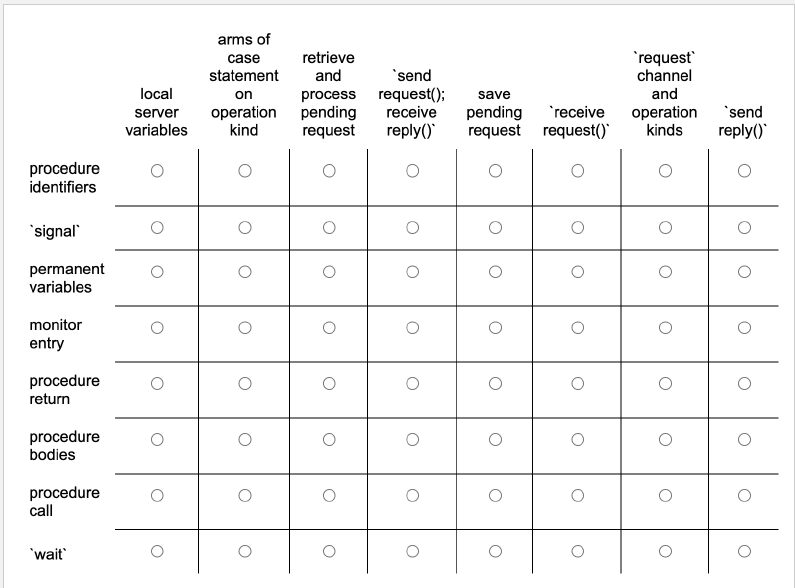
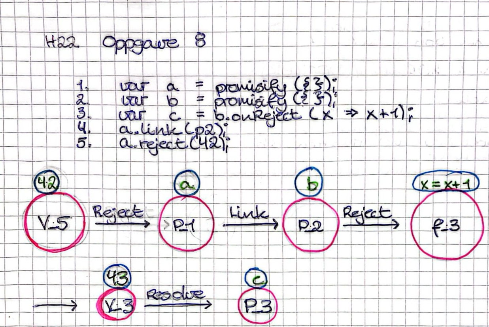
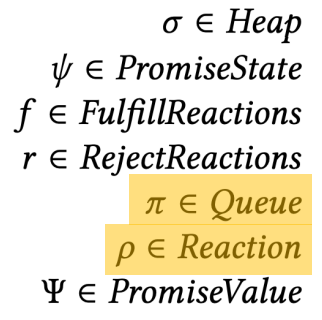
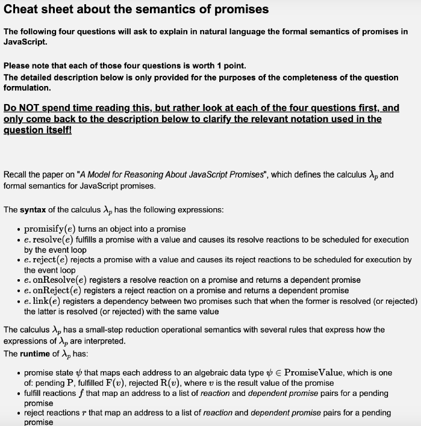
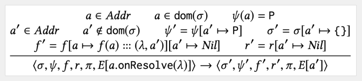
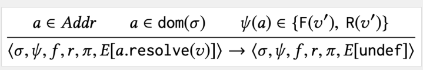

# INF214 EXAM H22
## Question 1:
Consider the following program:
```java
int x = 2;
int y = 3;
co
	< x = x + y > || < y = x * y>
oc
```
> What are the possible final values for x and y? Explain how you got those values.

### Answer:

> 1. `<x = x+y >` runs first, and then `<y = x*y>` runs. In this case, the result would be `x = 3+2 = 5` and `y = 5*3 = 15`
> 2. `<y = x*y>` runs first, and then `<x = x+y >` runs. In this case, the result would be `y = 2*3 = 6` and `x = 2+6 = 8`


## Question 2:
A semaphore is a program variable that holds an integer value. It can be manipulated by the operations `P` and `V`. 
Describe the semantics of these operations. 

### Answer: 

> **_Semaphore_**
> 
> A semaphore is a variable or abstract data type used to control access to a common resource by multiple threads and
> avoid critical section problems in a concurrent system such as a multitasking operating system. Semaphores are a type
> of synchronization primitive. Semaphores were conceived in part to make the critical section problem easy to solve.

So if `s` be a semaphore, then the operation `P` sets it to be 0 (true), iff it was 1 (false) to begin with. Since `P` 
tries to "grab" the semaphore each time, but only can when it is 1, you use an infinite `while`-loop in the `await`-
language. The same goes for the `V` operation: it keeps trying to "grab" the semaphore to set it to 1 (false), but only
can when it is 0 (true).

**The `P`-operation looks like this: `P(s) == <await (s>0) s = s - 1;>`**

**The `V`-operation looks like this: `V(s) == <s = s + 1;>`**


## Question 3: 
Three persons, who like gløgg very much, have gathered to play the following game in a bar. To drink a portion, each of 
them obviously needs three ingredients: the gløgg, a mug, and almonds. One player has the gløgg, the second has mugs, 
and the third has the almonds. Assume each of the players has an unlimited supply of their ingredients, respectively. 
The barista, who also has an unlimited supply of the ingredients, puts two random ingredients on the table. The player 
who has the third ingredient picks up the other two, makes the drink, and then drinks it. The barista waits for the
player to finish. This "cycle" then repeats. 

"Simulate" this behaviour in the AWAIT language. Represent the players and the barista as processes. Use semaphores for 
synchronization. Make sure that your solution avoids deadlock. 

### Answer: 
```java
/*
* Player 1 has gløgg, Player 2 has mugs, Player 3 has almonds
* The barista puts two random ingredients on the table
*/ 

sem gløgg = 0;
sem mugs = 0;
sem almonds = 0;
sem barista = 1;

process Barista(){
	while(true){		
	    // Put two random ingridients on the table
		P(barista);

		// The random missing ingredient (either 0=gløgg, 1=mugs, or 2=almonds)
		randomMissingIngridient = randomInt(0,2);
		
		// If the missing ingredient is gløgg
		if (randomMissingIngridient == 0){
			V(gløgg);
		}
		
        // If the missing ingredient is mugs 
		if (randomMissingIngridient == 1){
			V(mugs);
		}
		
		// If the missing ingredient is almonds
		if (randomMissingIngridient == 2){
			V(almonds);
		}
	}
}

/* The processes for the player ar identical, except for that they have different enter-conditions */ 
process Player1(){
	while(true){
		P(gløgg);
		makeGløgg();
		drinkGløgg();
		V(barista);
	}
}

process Player2(){
	while(true){
		P(mugs);
		makeGløgg();
		drinkGløgg();
		V(barista);
	}
}

process Player3(){
	while(true){
		P(almonds);
		makeGløgg();
		drinkGløgg();
		V(barista);
	}
}
```


## Question 4:
Recall the Readers/Writers problem: 

Readers processes query a database and the writer processes examine and modify it. Readers may access the databases 
concurrently, but writers require exclusive access. Although the database is shared, we cannot encapsulate it by a 
monitor, because readers could not then access it concurrently since all code within a monitor executes with mutual 
exclusion. Instead, we use a monitor merely to arbitrate access to the database. The database itself is global to the 
readers and writers. 

In the Readers/Writers problem, the arbitration monitor grants permission to access the database. To do so, it requires 
that processes inform it when they want access and when they have finished. There are two kinds of processes and two 
actions per process, so the monitor has four procedures: 
- `request_read`
- `release_read` 
- `request_write`
- `release_write`

These procedures are used in the obvious ways. For example a reader calls `request_read` before reading the database and 
calls `release_read` after reading the database. 

To synchronize access to the database, we need to record how many processes are reading and how many processes are 
writing. In the implementation below, `nr` is the number of readers, and `nw` is the number of writers; both of them are
initially 0. Each variable is incremented in the appropriate request procedure and decremented in the appropriate 
release procedure.
```java
monitor ReadersWriters_Controller(){
    int nr = 0;
    int nw = 0; 
    
    // Signalled when nw == 0
    cond OK_to_read; 
}

procedure request_read() {
    wait(OK_to_read);
    nr = nr + 1;
}

procedure release_read() { nr = nr - 1; }
procedure request_write() { nw = nw + 1; }
procedure release_write() { nw = nw - 1; }
```

A beginner has implemented this code, but it misses a lot of details related to synchronization. Help fix this code.

NOTE: Your solution does not need to arbitrate between readers and writers. 

### Answer:
```java
monitor ReadersWriters_Controller() {
    int nr = 0;
    int nw = 0;
    int waiting_writers = 0;
    
    // Signalled when nw == 0 or nr == 0
    cond OK_to_read; 
    cond OK_to_write;
}

// Reader's enter protocol
procedure request_read() {

    // Enter Protocol: Readers should wait if there's an active writer or if there are writers waiting
    if (nw > 0 || waiting_writers > 0) {
        wait(OK_to_read);
    }
   
    // critical section
    nr = nr + 1;
    
    // Exit Protocol: Signal to other readers that it's OK to read
    signal(OK_to_read); 
}

// Reader's exit protocol
procedure release_read() {
    
    // critical section
    nr = nr - 1;
    
    // Exit Protocol: If there's no more readers, signal to other writers that it's OK to write
    if (nr == 0){
        signal(OK_to_write);
    }
}

// Writer's enter protocol
procedure request_write() { 

    // Increment count of waiting writers
    waiting_writers = waiting_writers + 1;
    
    // Enter Protocol: Writers should wait if there's active readers or another writer's active
    if (nr > 0 || nw > 0) {
        wait(OK_to_write);
    }
    
    // critical section
    waiting_writers = waiting_writers - 1;
    nw = nw + 1;
}

// Writer's exit protocol
procedure release_write() { 
    
    // critical section
    nw = nw - 1; 
    
    // Exit Protocol: If there's writers waiting, signal next writer, otherwise signal readers that it's OK to read
    if (waiting_writers > 0) { 
        signal(OK_to_write); 
    } else {
        signal(OK_to_read);
    }
}
```


## Question 5:
There's duality between monitors and message passing. What is that duality exactly? In the table, the rows represent 
notions about monitors, and the columns represent notions about message passing. Click the circle in a cell to represent
that a notion about monitors is dual to a notion about message passing. 



### Answer: 
Here’s how we map the notions in monitors to the corresponding concepts in message passing, identifying which cells 
should be "checked" (i.e., have duality):

    Procedure identifiers:
        Duals with: send request(); receive_reply();
            Explanation: 
            A procedure identifier in a monitor refers to a procedure that is invoked when a process wants to enter a 
            critical section. In message passing, send request(); receive_reply(); corresponds to the act of sending a 
            message to a process and receiving a response, analogous to procedure invocation in monitors.

    signal:
        Duals with: send_reply()
            Explanation: 
            signal in a monitor wakes up a waiting process. Similarly, in message passing, send_reply() sends a reply 
            back to a requester, effectively "signaling" that the request is complete and the waiting process can 
            proceed.

    Permanent variables:
        Duals with: request channel and operation kinds
            Explanation: 
            Permanent variables in a monitor are used to maintain state or store shared data. In message passing, the 
            concept of a "request channel" and "operation kinds" corresponds to maintaining communication channels and 
            defining message types, which are a form of permanent variables in message-passing systems.

    Monitor entry:
        Duals with: receive_request()
            Explanation: 
            In a monitor, entry refers to entering the monitor's critical section. Similarly, in message passing, 
            receive_request() corresponds to a process receiving a request and then entering a state to process that 
            request, analogous to entering the critical section in a monitor.

    Procedure return:
        Duals with: receive_reply()
            Explanation: 
            In monitors, a procedure return occurs when a process finishes executing a monitor procedure. In message 
            passing, after processing a request, receive_reply() corresponds to the receipt of the reply, signaling that
            the message passing operation has finished, analogous to returning from a procedure.

    Procedure bodies:
        Duals with: retrieve and process pending request
            Explanation: 
            Procedure bodies in monitors define the actual code that executes when a procedure is called. In message 
            passing, retrieving and processing a pending request is analogous to executing the body of the procedure, 
            where the system retrieves and processes messages.

    Procedure call:
        Duals with: send request()
            Explanation: 
            A procedure call in a monitor invokes a procedure to be executed. In message passing, send request() is the 
            equivalent action where a process sends a message, requesting the service or action of another process.

    wait:
        Duals with: save pending request()
            Explanation: 
            In a monitor, wait causes a process to suspend execution until a condition is satisfied. In message passing,
            save pending request() corresponds to saving a request when it cannot be processed immediately, similar to 
            waiting in a monitor.


## Question 6: 
Using Communicating Sequential Processes, define a process `Copy` that copies a character from process `Vestland` to 
process `Bergen`. 

### Answer: 
```java
process Copy(){
	char c;
	co:
	Vestland?c 	->  // Recieve a character from Vestland and store it in 'c'
	Bergen!c;       // Send the character stored in 'c' through Bergen
	oc
}
```
Explanation:

`Vestland?c`: This action causes the Copy process to receive a character from `Vestland`. The received character is stored 
              in the variable c.

`->`: indicates that these actions occur in sequence: first the "receive", then the "send".

`Bergen!c`: After receiving the character, the Copy process sends the character stored in c through the Bergen channel.


## Question 7: 
Using JavaScript, define a promise which is immediately resolved. Use `console.log` to print out the value of the 
promise.

### Answer: 
```javascript 
const myPromise = Promise.resolve("Hello, world!");

// Log the resolved value of the promise
myPromise.then(value => console.log(value));
```
`Promise.resolve("Hello, world!")`: This creates a promise that is immediately resolved with the value "Hello, world!".

`.then(value => console.log(value))`:   The `.then()` method is used to handle the resolved value of the promise. In 
                                        this case, we’re using console.log to print out the value once the promise 
                                        resolves.


## Question 8:
Consider the JavaScript code 
```javascript
var a = promisify({});
var b = promisify({});
var c = b.onReject(x => x + 1);
a.link(p2);
a.reject(42);
```
Note the syntax is a blend of `JavaScript` and λ (`$$\Lambda$$`) which uses: 
- **prmoisify** to create promise
- **onReject** to register a reject reaction
- **link** to link promises (linking means that when the original promise is resolved/rejected, then the linked promise 
will be resolved/rejected with the same value)

**Draw a promise graph for this code** 

Remember to use the names of nodes in that graph that represent the "type" of node: 
- **v** for value
- **f** for function
- **p** for promise

with a subscript that represents the **line number** where the particular value/function/promise has beed **declared/
where it appears first**.

For example, the value 42 on line 5 will be denoted by **`v_5`** in the promise graph. 

### Answer: 
Step-by-Step breakdown of the code: 
```javascript
var a = promisify({});              // new promise "a" which we call P_1
var b = promisify({});              // new promise "b" which we call P_2
var c = b.onReject(x => x + 1);     // new rejection handler "c" for P_2 which we call f_3
a.link(p2);                         // link P_1 to P_2, i.e., if P_1 is resolved or rejected, P_2 will also be
a.reject(42);                       // rejects P_1 (and also P_2 because of link) with the value V_5 = 42
```

Promise graph: 

Explanation of Nodes and Flow:

1. (v_5 / 42): This is the value 42 used to reject p_1 (a.reject(42)).
2. (a / p_1): The promise a (created on line 1) is rejected with v_5.
3. Link => (b / p_2): Since p_1 is linked to p_2, p_2 (created on line 2) is also rejected with v_5.
4. (f_3 / x => x + 1): This is the rejection handler function registered on p_2 with onReject on line 3, which adds 1 to the rejected value.
5. (v_3 / 43): The result of calling f_3 with 42 is 43, which resolves p_3.
6. (c / p_3): The promise returned by onReject on line 3 (p_3) is resolved with v_3 = 43.


## Question 9: 
Consider the following HTML/JavaScript attached in the PDF file to this question.
This code runs on a computer of a super-user, who clicks the button `myButton` 6 ms after the execution starts.

What happens at particular time points?
```html

<button id="myButton"></button>
<script>
    setTimeout(function timeoutHandler() {
        /* code that runs for 6 ms*/
    }, 10);

    setInterval(function intervalHandler() {
        /* code that runs for 8 ms */
    }, 10);

    const myButton = document.getElementById("myButton");
    
    myButton.addEventListener("click", function clickHandler() {
        Promise.resolve().then(() => { /* some promise handling code that runs for 4 ms */ });
        /* click-handling code that runs for 10 ms */
    });
    /* code that runs for 18 ms */ 
</script>
```

| What happens...                    | ...at what time? |
|------------------------------------|------------------|
| `clickHandler` finishes            | at X ms          |
| `clickHandler` starts              | at X ms          |
| interval fires for the first time  | at X ms          |
| interval fires for the second time | at X ms          |
| interval fires for the third time  | at X ms          |
| interval fires for the fourth time | at X ms          |
| `intervalHandler` starts           | at X ms          |
| `intervalHandler` finishes         | at X ms          |
| mainline execution starts          | at 0 ms          |
| mainline execution finishes        | at X ms          |
| promise handler starts             | at X ms          |
| promise handler finishes           | at X ms          |
| promise resolved a tiny bit after  | at X ms          |
| `timeoutHandler` starts            | at X ms          |
| `timeoutHandler` finishes          | at X ms          |
| timer fires                        | at X ms          |
| user clicks button                 | at 6 ms          |


### Answer:
| What happens...                    | ...at what time? |
|------------------------------------|------------------|
| `clickHandler` finishes            | at 28 ms         |
| `clickHandler` starts              | at 18 ms         |
| interval fires for the first time  | at 10 ms         |
| interval fires for the second time | at 20 ms         |
| interval fires for the third time  | at 30 ms         |
| interval fires for the fourth time | at 40 ms         |
| `intervalHandler` starts           | at 38 ms         |
| `intervalHandler` finishes         | at 46 ms         |
| mainline execution starts          | at 0 ms          |
| mainline execution finishes        | at 18 ms         |
| promise handler starts             | at 28 ms         |
| promise handler finishes           | at 32 ms         |
| promise resolved a tiny bit after  | at 18 ms         |
| `timeoutHandler` starts            | at 32 ms         |
| `timeoutHandler` finishes          | at 38 ms         |
| timer fires                        | at 10 ms         |
| user clicks button                 | at 6 ms          |


## Question 10: 




What does this rule describe?


Options:
1. This rule handles the case when a pending promise is resolved.
2. This rule states that resolving a settled promise has no effect.
3. This rule handles the case when a fulfill reaction is registered on a promise that is already resolved.
4. This rule registers a fulfill reaction on a pending promise.
5. This rule extracts a fulfill reaction from the queue, executes it with the promise's value, and uses the returned
   value to resolve the dependent promise.

### Answer:
4. This rule registers a fulfill reaction on a pending promise.


## Question 11:
What does this rule describe?


Options:
1. This rule handles the case when a pending promise is resolved.
2. This rule turns an address into a promise
3. This rule handles the case when a fulfill reaction is registered on a promise that is already resolved.
4. This rule states that resolving a settled promise has no effect.

### Answer:
4. This rule states that resolving a settled promise has no effect.

## Question 12:
What does this rule describe?


Options:
1. This rule causes a pending promise to be "linked" to another.
2. This rule causes an already settled promise to be "linked" to another.
3. This rule causes a non-settled promise to be "linked" to another.
4. This rule causes a promise to be "linked" to another, With no regards to the state of that original promise.

### Answer:
4. This rule causes a promise to be "linked" to another, With no regards to the state of that original promise.


## Question 13:
What does this rule describe?


Options:
1. This rule enables evaluation and recomposition of expressions according to the evaluation contexts.
2. This rule turns an address into a promise.
3. This rule registers a fulfill reaction on a pending promise.
4. This rule clears fulfill and reject reactions of a settled promise.
5. This rule registers a reject reaction on a pending promise.

### Answer:
4. This rule clears fulfill and reject reactions of a settled promise.