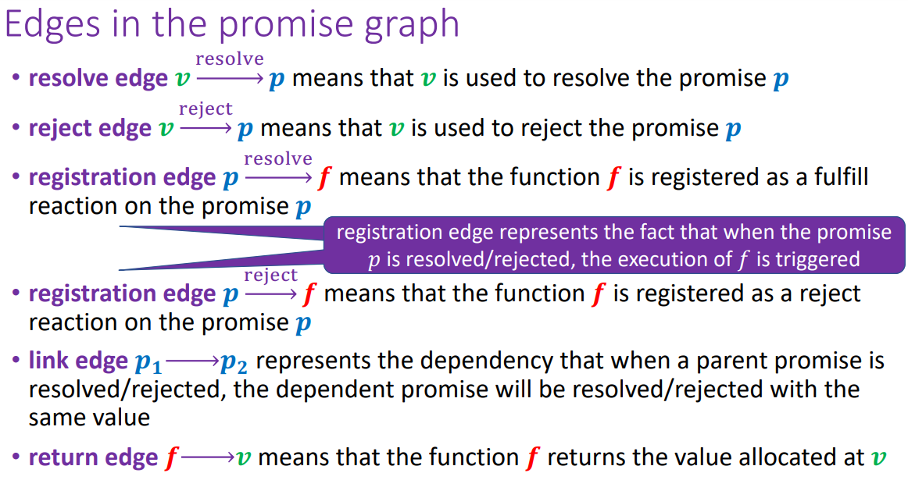

# Promise Graphs


## Question 1:
```javascript
var a = promisify({});
var b = a.onResolve(x => x + 1);
a.resolve(42);
```

## Question 2:
```javascript
var a = promisify({});
var b = a.onResolve(x => x + 1);
var c = a.onReject(x => x - 1);
a.resolve(42);
```

## Question 3: 
```javascript
var a = promisify ({}) ;
var b = promisify ({}) ;
var c = b.onReject(x => x + 1);
a.link(b);
a.reject(42);
```

## Question 4: 
```javascript
var a = promisify({});
var b = a.onResolve(x => x + 1);
var c = a.onResolve(y => y - 1);
a.resolve(100);
```