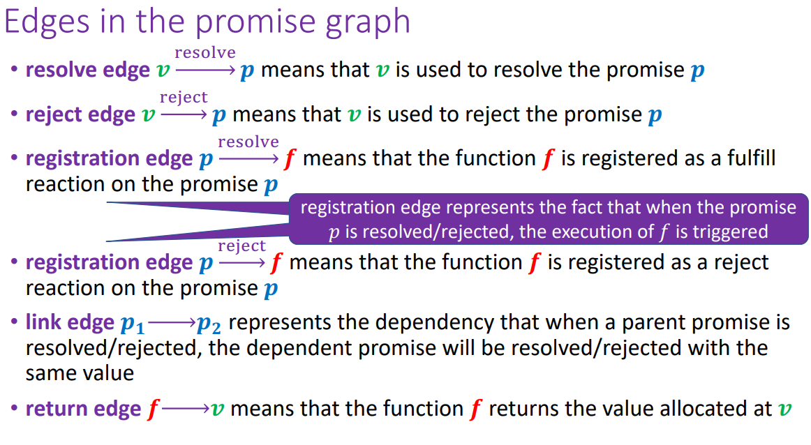

# Promise Graphs


## Question 1:
```javascript
var a = promisify({});
var b = a.onResolve(x => x + 1);
a.resolve(42);
```
### Answer:
```javascript
var a = promisify({});              // new promise (P1/a) 
var b = a.onResolve(x => x + 1);    // resolve handler for (P1/a), (f2/b) 
a.resolve(42);                      // root (V3/42) resolves (P1/a) 
```
`(V3/42) --Resolve--> (P1/a) --Resolve--> (f2/b/x => x+1) --> (V4/c/43)`


## Question 2:
```javascript
var a = promisify({});
var b = a.onResolve(x => x + 1);
var c = a.onReject(x => x - 1);
a.resolve(42);
```
### Answer:
```javascript
var a = promisify({});              // new promise (P1/a) 
var b = a.onResolve(x => x + 1);    // resolve handler for (P1/a), (f2/b/x => x+1)
var c = a.onReject(x => x - 1);     // reject  handler for (P1/a), (f3/c/x => x-1)
a.resolve(42);                      // root (V4/42) resolves (P1/a)
```

```
(V4/42) --Resolve--> (P1/a) --Resolve--> (f2/b/x => x+1) --> (V5/43)
                        |
                        v
                        +-----Reject---> (f3/c/x => x-1) --> (V6/41) --Resolve--> (P2/d)
```

## Question 3:
```javascript
var a = promisify ( { } ) ;
var b = promisify ( { } ) ;
var c = b.onReject(x => x + 1);
a.link (b);
a.reject(42);
```
### Answer:
```javascript
var a = promisify ({}) ;        // new promise (P1/a) 
var b = promisify ({}) ;        // new promise (P2/b) 
var c = b.onReject(x => x + 1); // new reject handler (f3/c/x => x+1)
a.link(b);                      // link between (P1/a) and (P2/b) 
a.reject(42);                   // root (V5/42) rejects (P1/a)
```
`(V5/42) --Reject--> (P1/a) --Link--> (P2/b) --Reject--> (f3/c/x => x+1) --> (V3/43) --Resolve--> (P3/c)`

## Question 4:
```javascript
var a = promisify({});
var b = a.onResolve(x => x + 1);
var c = a.onResolve(y => y - 1);
a.resolve(100);
```
### Answer:
```javascript
var a = promisify({});              // new promise (P1/a) 
var b = a.onResolve(x => x + 1);    // new resolve handler (f2/b/x => x+1) 
var c = a.onResolve(y => y - 1);    // new resolve handler (f3/c/y => y-1) 
a.resolve(100);                     // root (V4/100) resolves (P1/a) 
```

```
(V4/100) --Resolve--> (P1/a) --Resolve--> (f2/b/x => x+1) --> (V5/101)
                        |
                        v
                        + -----Resolve--> (f3/c/y => y-1) --> (V6/99) 
```