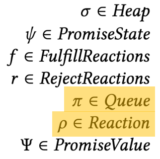
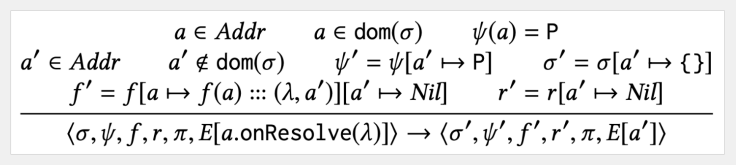
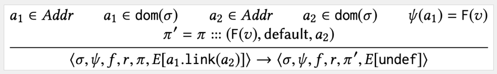

# Exercises

## EXAM H22 
### Task 10.1:
What does this rule describe?

Options:
1. This rule handles the case when a pending promise is resolved.
2. This rule states that resolving a settled promise has no effect.
3. This rule handles the case when a fulfill reaction is registered on a promise that is already resolved.
4. This rule registers a fulfill reaction on a pending promise.
5. This rule extracts a fulfill reaction from the queue, executes it with the promise's value, and uses the returned
   value to resolve the dependent promise.

#### Answer: 
4. This rule registers a fulfill-reaction on a pending promise.

###  Task 10.2:
What does this rule describe?

Options:
1. This rule handles the case when a pending promise is resolved.
2. This rule turns an address into a promise
3. This rule handles the case when a fulfill reaction is registered on a promise that is already resolved.
4. This rule states that resolving a settled promise has no effect.

#### Answer:
4. This rule states that resolving a settled promise has no effect.

###  Task 10.3:
What does this rule describe?

Options:
1. This rule causes a pending promise to be "linked" to another.
2. This rule causes an already settled promise to be "linked" to another.
3. This rule causes a non-settled promise to be "linked" to another.
4. This rule causes a promise to be "linked" to another, With no regards to the state of that original promise.

#### Answer:
4. This rule causes a promise to be "linked" to another, With no regards to the state of that original promise.

###  Task 10.4:
What does this rule describe?

Options:
1. This rule enables evaluation and recomposition of expressions according to the evaluation contexts.
2. This rule turns an address into a promise.
3. This rule registers a fulfill reaction on a pending promise.
4. This rule clears fulfill and reject reactions of a settled promise.
5. This rule registers a reject reaction on a pending promise.

#### Answer:
4. This rule clears fulfill and reject reactions of a settled promise.

## EXAM V24
### Task 11.1:
What does this rule describe?

Options:
1. This rule handles the case when a pending promise is resolved.
2. This rule states that resolving a settled promise has no effect.
3. This rule handles the case when a fulfill reaction is registered on a promise that is already resolved.
4. This rule registers a fulfill reaction on a pending promise.
5. This rule extracts a fulfill reaction from the queue, executes it with the promise's value, and uses the returned
   value to resolve the dependent promise.

#### Answer:
4. This rule registers a fulfill-reaction on a pending promise.

### Task 11.2: 
What does this rule describe?

Options:
1. This rule handles the case when a pending promise is resolved.
2. This rule turns an address into a promise
3. This rule handles the case when a fulfill reaction is registered on a promise that is already resolved.
4. This rule states that resolving a settled promise has no effect.

#### Answer:
4. This rule states that resolving a settled promise has no effect.

### Task 11.3: 
What does this rule describe? 
