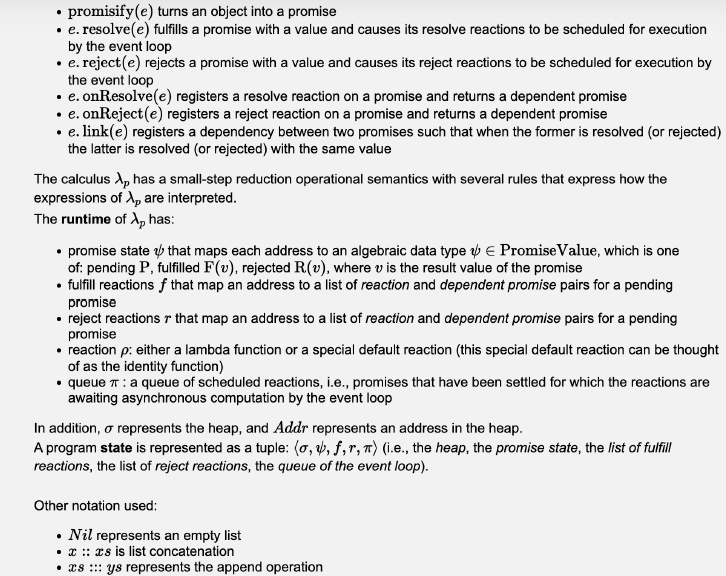
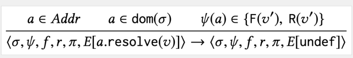

# Semantics of Promises: 
## Cheet Sheat 1:
$$\begin{align}
& \sigma \in Heap \newline
& \psi \in \text{PromiseState} \newline
& f \in \text{FulfillReactions} \newline
& r \in \text{RejectReactions} \newline
& \pi \in \text{Queue} \newline
& p \in \text{Reaction} \newline
& \Psi \in \text{PromiseValue} \newline
\end{align}$$
## Cheet Sheat 2:

The **syntax** of the calculus λ has the following expressions: 

$$ \begin{flalign}
& \textbf{promisify(e)} \text{ turns an object into a promise} & \newline
& \textbf{e.resolve(e)} \text{ fulfills a promise with a value and causes its resolve reaction to be scheduled for 
execution by the event loop} & \newline
& \textbf{e.reject(e)} \text{ rejects a promise with a value and causes its reject reaction to be scheduled for 
execution by the event loop} & \newline
& \textbf{e.onResolve(e)} \text{ registers a resolve reaction on a promise and returns a dependant promise} & \newline
& \textbf{e.onReject(e)} \text{ registers a reject reaction on a promise and returns a dependant promise} & \newline
& \textbf{e.link(e)} \text{ registers a dependency between two promises s.t. when the former is resolved/rejected the 
latter is also} & \newline
\end{flalign} $$

The **runtime** of lambda_p has: 

$$ \begin{flalign}
& \textbf{prmosie state } \psi \text{: maps each address to an algebraic data type } \psi \in \text{PromiseValue } & 
\newline
& \text{which is one of: pending P, fulfilled F(v), rejected R(v), where v is the result value of the promise.} & 
\newline
\newline
& \textbf{fulfill reactions f} \text{: maps an address to a list of reaction and dependent promise pairs for a } &
\newline
& \text{pending promise} &
\newline
\newline
& \textbf{reject reactions r} \text{: map an address a to a list of reaction and dependent promise pairs for a } &
\newline
& \text{pending promise} &
\newline
\newline
& \textbf{reaction p} \text{: either a lambda functioin or a special default reaction (identity function)} &
\newline
\newline
& \textbf{queue } \pi \text{: a queue of scheduled reactions, i.e. promises that have been settled for which the } &
\newline
& \text{reactions are awaiting asynchronous computation by the event loop} &
\end{flalign} $$

$$ \begin{flalign}
\newline
\newline
& \text{In addition } & \newline
& \phi & = &  \text{ the Heap} & \newline
& Addr & = & \text{address in the heap} & \newline
& \langle \sigma, \psi, f, r, \pi \rangle & = &  \text{ heap, promise state, list of fulfill reactions, list of reject
reactions, queue of event loop} \newline
& Nil & = & \text{ empty list} \newline
& x :: xs & = & \text{ list concatenation (merging lists)} \newline
& xs ::: ys & = & \text{ represents the append operation (here between two lists)} \newline \newline
\end{flalign} $$

--- 

### Rule 1:

$$\begin{gather}
a \in Addr & a \in dom(\sigma) & \psi(a) = P 
\end{gather} $$
$$\begin{gather}
a' \in Addr & a' \notin dom(\sigma) & \psi' = \psi[a'\mapsto P] & \sigma'=\sigma[a' \mapsto \text{{}}]
\end{gather} $$
$$\begin{gather}
f' \mapsto f[a \mapsto f(a) ::: (\lambda,a')][a' \mapsto Nil] & r'=r[a' \mapsto Nil]
\end{gather} $$
---
$$\begin{gather}
\langle \sigma,\psi,f,r,\pi,E[a.onResolve(\lambda)] \rangle \rightarrow \langle \sigma',\psi',f',r',\pi,E[a'] \rangle 
\end{gather} $$
---

#### Explanation:
$$\begin{flalign}
a \in Addr &: \text{ a is the address of an object} 
\newline
a \in dom(\sigma) &: \text{ a is allocated in the heap } dom(\sigma) 
\newline
\psi(a) = P &: \text{ the promise is in the pending state} 
\newline
a' \in Addr &: \text{ allocate a dependent promise with address } 
\newline
a' \notin dom(\sigma) &: \text{ a' is not in the heap } dom(\sigma). 
\newline
\psi' = \psi[a' \mapsto P] &: \text{ new promise } \psi' \text{ is created by updating } \psi 
\text{ by adding a new promise at address a' with state P}. 
\newline
\sigma\ = \sigma[a' \mapsto \text{{}}] &: \sigma \text{ is updated by mapping the new address a' to an empty value {}}
\newline
\lambda &: \text{ the fulfill reaction} \newline
[a' \mapsto Nil] &: \text{ initialize its reaction to the empty list } Nil \newline
a \mapsto f(a) ::: (\lambda,a') &: \text{ value from f(a) is updated to include new fulfill reaction } (λ,a') \newline
r' = r[a \mapsto Nil] &: \text{ reaction r' is created from r by mapping a to the empty list} \newline
a \mapsto f(a) ::: (\lambda, a') &: \text{ add the pair} (\lambda, a') \text{ to the fulfill reactions of the original}
\text{ promise } a \newline 
\end{flalign}$$

$$\begin{align}
\newline
\text{When `a` is eventually resolved the function } \lambda \text{ will be executed asynchronously by the event loop,}
\newline \text{and its return value will be used to resolve the dependent promise } a' \newline \newline
\text{In other words: } \textbf{This rule registers a fulfill reaction on a pending promise.}
\end{align}$$

### Rule 2: 

#### Explanation:
$$\begin{flalign}
a \in Addr &: \text{ a is the address of an object} \newline
a \in dom(\sigma) &: \text{ a is allocated in the heap } dom(\sigma) \newline
\psi(a) = F(v) &: \text{ the promise has been fulfilled with a value v according to the promise state map } \psi \newline
a' \in Addr &: \text{ allocate a dependent promise with address a'} \newline
a' \mapsto Nil &: \text{ initialize its reaction to the empty list } Nil \newline
a \notin dom(\sigma) &: 
\newline
a \mapsto f(a) ::: (\lambda, a') &: \text{ add the pair} (\lambda, a')  
\text{to the fulfill reactions of the original promise a} \newline \newline
x :: xs &: \text{list concatenation (merging lists)} \newline
xs ::: ys &: \text{represents the append operation (here between two lists)}
\end{flalign}$$

$$\begin{align}
\newline
\text{When `a` is eventually resolved the function } \lambda \text{ will be executed asynchronously by the event loop,}
\newline \text{and its return value will be used to resolve the dependent promise } a' \newline \newline
\text{In other words: } \textbf{This rule registers a fulfill reaction on a pending promise.}
\end{align}$$

### Rule 3:

#### Explanation:
$$\begin{flalign}
a \in Addr &: \text{ a is the address of an object} \newline
a \in dom(\sigma) &: \text{ a is allocated in the heap } dom(\sigma) \newline
\lambda &: \text{ the fulfill reaction} \newline
\psi(a) = P &: \text{ the promise is in the pending state} \newline
a' \in Addr &: \text{ allocate a dependent promise with address a'} \newline
a' \mapsto Nil &: \text{ initialize its reaction to the empty list } Nil \newline
a \mapsto f(a) ::: (\lambda, a') &: \text{ add the pair} (\lambda, a') \text{to the fulfill reactions of the original
promise a}  \newline \newline
Nil &: \text{represents an empty list} \newline
x :: xs &: \text{list concatenation (merging lists)} \newline
xs ::: ys &: \text{represents the append operation (here between two lists)}
\end{flalign}$$

$$\begin{align}
\newline
\text{When `a` is eventually resolved the function } \lambda \text{ will be executed asynchronously by the event loop,}
\newline \text{and its return value will be used to resolve the dependent promise } a' \newline \newline
\text{In other words: } \textbf{This rule registers a fulfill reaction on a pending promise.}
\end{align}$$

